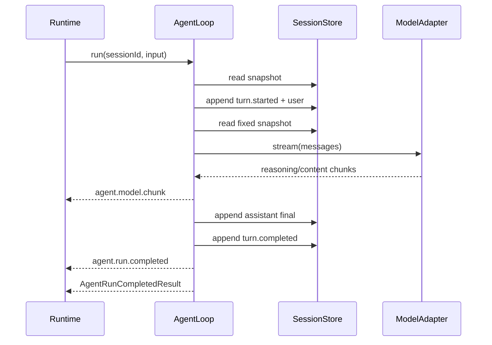
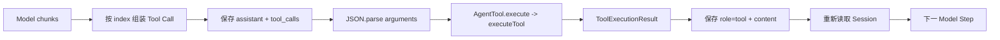

# Agent Loop：从用户输入到确定终态

## 1. 前置知识

建议先阅读：

1. [Tool Harness](./tool-harness.md)
2. [ModelAdapter](./model-adapter.md)
3. [Session Log](./session-log.md)
4. [Agent Loop 当前规范](../standards/protocols/agent-loop.md)

## 2. 学习目标

完成本篇后，你应该能够解释：

- Run、Turn、Step、Tool Call 和 Attempt 的区别。
- 为什么每个 Step 要从 Session Log 重新推导消息。
- 流式 Tool Call 的碎片怎样变成一次可执行调用。
- 工具错误为什么通常写回模型，而不是让整个 Run 抛错。
- `completed`、`stopped` 和 `failed` 有什么不同。
- 为什么第一版串行执行多个工具，也不自动重试模型。

## 3. 模块地图

```text
src/craft-agent/core/
  types.ts           # 配置、预算、事件、工具注册项和 Run 结果
  tool-registry.ts   # DefinedTool -> AgentTool 泛型擦除边界
  agent-loop.ts      # 主状态机、Session 写入和终态收口
  model-stream.ts    # 模型流和 Tool Call 分片组装
  run-state.ts       # Run 内游标、usage 和结果快照
  stop-policy.ts     # 预算、组合取消信号和停止原因
  errors.ts          # 模型、Session 和调用前工具错误归一化
  index.ts           # Core 公共导出
```

推荐阅读顺序：`types.ts` → `stop-policy.ts` → `tool-registry.ts` → `AgentLoop.run()` →
`runModelStep()` → `model-stream.ts` → `executeToolCalls()` → 三个 `finish*()`。

## 4. 最小使用示例

```ts
import { z } from 'zod'
import {
  AgentLoop,
  createAgentTool,
  defineTool,
  MemorySessionStore,
} from './craft-agent'

const weather = defineTool({
  name: 'weather',
  description: '查询指定城市天气',
  inputSchema: z.strictObject({ city: z.string() }),
  outputSchema: z.strictObject({ summary: z.string() }),
  metadata: {
    risk: 'read',
    capabilities: ['network:public'],
  },
  async execute(input, context) {
    // 真实实现应把 context.signal 传给 fetch。
    return { summary: `${input.city} 晴` }
  },
})

const loop = new AgentLoop({
  model,
  store: new MemorySessionStore(),
  tools: [createAgentTool(weather)],
  systemPrompt: '你是一个可靠的助手。',
  limits: {
    maxModelSteps: 8,
    maxToolCalls: 16,
    maxDurationMs: 60_000,
  },
})

const result = await loop.run({
  sessionId: 'session-1',
  input: '杭州天气怎么样？',
}, {
  onEvent(event) {
    if (event.type === 'agent.model.chunk')
      console.log(event.chunk.choices[0]?.delta.content ?? '')
  },
})
```

为什么要 `createAgentTool(weather)`：每个 `DefinedTool` 都保留自己精确的 Zod 输入输出泛型，而工具数组必须是同一种
运行时类型。包装函数只擦除数组不需要的泛型，闭包里仍调用 `executeTool()`，不会绕过 Schema、权限或重试。

## 5. 一次无工具回答



这里的实时 chunk 可以立刻显示，但只有 assistant final 写入 Session 后，才成为下一次模型调用可重建的历史。

## 6. 一次工具循环

模型经常把一次调用拆成多个 chunk：

```text
chunk 1: index=0, id=call-1, name="wea", arguments="{\"city\":"
chunk 2: index=0,            name="ther", arguments="\"杭州\"}"
```

Loop 组装成：

```ts
const toolCall = {
  id: 'call-1',
  type: 'function',
  function: {
    name: 'weather',
    arguments: '{"city":"杭州"}',
  },
}
```

完整数据流：



先保存调用意图，再执行副作用，是为了让日志知道“模型要求做什么”。每个结果执行后立即追加，避免在整个批次结束前
丢失已经完成的事实。

## 7. 三种终态

### completed

模型提供最终文本，assistant 消息和 `turn.completed` 都写入成功。

### stopped

控制系统主动结束，例如达到 Step、Tool、token、时间预算，调用方取消，或模型以 length/content filter 停止。
这是可解释的受控终止，不等于基础设施崩溃。

### failed

ModelAdapter、模型协议或 SessionStore 出错。结果仍是稳定对象，Runtime 不需要靠捕获任意供应商异常来判断状态。

配置和请求本身无效是开发错误，例如空 `sessionId`、空输入或零预算，会在执行前抛 `TypeError`。

## 8. 为什么工具失败可以继续

工具不存在、JSON 参数错误、Schema 错误、权限拒绝或业务异常都会形成模型可见的错误 content：

```text
assistant: tool_calls=[call-1]
tool:      tool_call_id=call-1, content="Error: ..."
```

下一 Step 的模型可以解释错误、修正参数、换用其他工具或直接回答。若 Loop 在第一次工具错误时整体崩溃，模型就失去
自我修正机会。

## 9. 为什么预算检查位置不同

- Step 预算：每次模型调用前检查。
- Tool Call 预算：整批工具执行和调用意图持久化前检查。
- token 预算：依据上一个 Step 最终 usage，在下一 Step 前检查。
- 时间和调用方取消：Run 边界、Model Step 后和每个 Tool Call 前都检查。

工具批次使用“全批接受或全批拒绝”。如果额度只剩一个，而模型同时要求两个，不能只执行第一个后留下另一个没有结果。

## 10. 并发冲突怎么理解

Loop 读到 Session version 5，并基于消息 1..5 调用模型。其他 Writer 随后写入 version 6，那么旧模型输出不能直接作为
version 7 追加，因为它没有看过第 6 条事实。

当前行为是以 `SESSION_VERSION_CONFLICT` 失败。Loop 不自动重试，因为：

- 模型可能已经输出了用户看到的流增量。
- 工具可能已经产生外部副作用。
- 自动重放需要幂等键、恢复点和未完成 Turn 协议，而不是简单再跑一次。

## 11. 建议断点

第一次调试只走最终回答路径，依次观察：

```text
state.sessionVersion
snapshot.events
deriveModelMessages(snapshot.events)
stepResult.content
stepResult.finishReason
state.usage
AgentRunResult
```

第二次调试工具路径，观察：

```text
pending[index]
toolCalls[]
parsed.value
ToolExecutionResult.content
role=tool message
下一 Step 的 request.messages
```

运行测试：

```bash
pnpm test -- --run test/agent-loop.test.ts
```

## 12. 练习

1. 写一个 `echo` 工具，让模型调用后再总结结果。
2. 把工具参数改成非法 JSON，观察工具没有执行但模型得到错误消息。
3. 把 `maxModelSteps` 设为 1，让第一步返回工具调用，确认结果是 `max_model_steps`。
4. 一次返回两个 Tool Call，把 `maxToolCalls` 设为 1，确认两个都没有执行。
5. 在 `agent.step.started` 时模拟另一个 Writer 追加事件，观察 Session 版本冲突。
6. 让 `onEvent` 抛错，确认最终回答仍正常完成。
7. 使用 AbortController 在工具执行中取消，确认剩余 Tool Call 得到 `TOOL_ABORTED` 消息。

## 13. 当前边界

本阶段已完成核心循环，但还没有：

- 用 Fastify/SSE 暴露标准 Runtime 接口。
- 持久化和分页查询实时 Agent/Tool 轨迹。
- 未完成 Tool Call 的崩溃恢复与安全重放。
- ModelAdapter 自动重试。
- 完整服务端 stack/cause 诊断和 `errorId`。

这些边界被明确保留，避免过渡 Runtime 或某个数据库的实现细节反向进入 Core。
