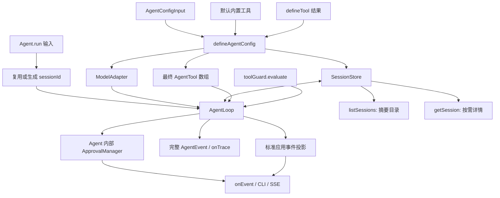
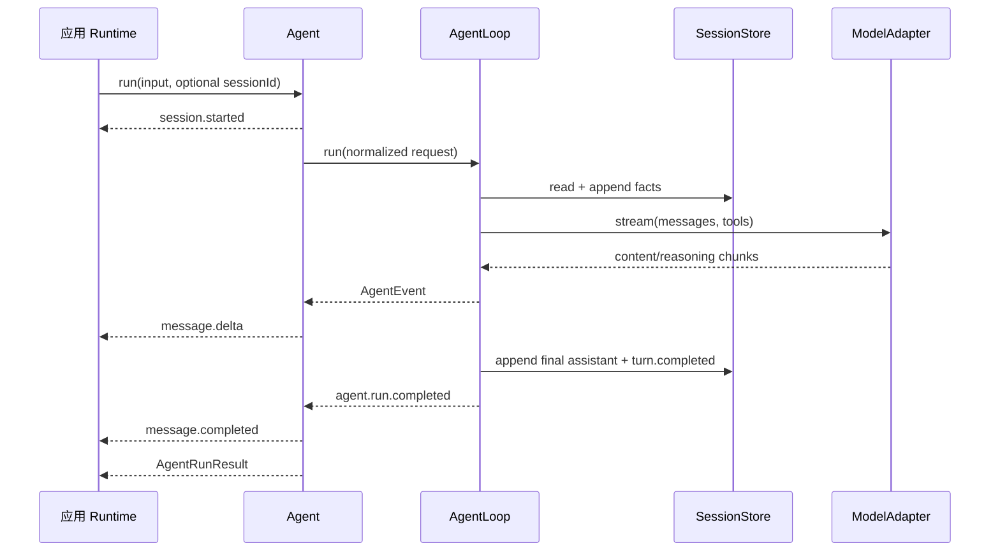

# CraftAgent 统一入口：从配置到会话查询

## 1. 学习目标

完成本篇后，你应该能解释：

- 为什么日常应用使用 `Agent`，底层测试和扩展仍保留 `AgentLoop`。
- `defineAgentConfig()` 如何把开发者输入归一化为内部协议。
- 精简输出事件与完整轨迹事件为什么必须分层。
- Session ID、事实日志和会话列表如何流转。
- ToolGuard 风险规则与 Agent 内部审批生命周期如何分工。

## 2. 模块地图

```text
src/craft-agent/agent/
  config.ts        # 模型配置、依赖注入、预算和默认值归一化
  normalize-tools.ts # 原始 DefinedTool 到 AgentTool 的内部归一化
  tool-guard.ts    # 风险评估输入、决定和应用审批事件
  tool-approval-manager.ts # 内部 pending、超时、取消和一次性决定
  types.ts         # run 输入、精简输出和会话查询类型
  agent.ts         # AgentLoop 门面、标准应用事件和 Session 查询
  index.ts         # 本模块导出
```

推荐阅读顺序：`types.ts` → `config.ts` → `normalize-tools.ts` → `Agent.run()` →
`createOutputProjector()` → `listSessions()`。

## 3. 完整使用示例

```ts
import Agent, { defineTool } from 'craft-agent'
import { z } from 'zod'

const echoTool = defineTool({
  name: 'echo',
  description: '返回输入文字。',
  inputSchema: z.strictObject({ text: z.string() }),
  outputSchema: z.strictObject({ text: z.string() }),
  security: { risk: 'safe', capabilities: [], idempotent: true },
  execute(input) {
    return input
  },
})

const agent = new Agent({
  model: {
    provider: 'openai-compatible',
    providerName: 'my-provider',
    apiKey: process.env.MODEL_API_KEY!,
    baseURL: 'https://example.com/v1',
    model: 'example-model',
  },
  tools: {
    additional: [echoTool],
  },
  execution: {
    limits: { maxModelSteps: 8, maxToolCalls: 16 },
  },
})

const result = await agent.run({ input: '复述 hello' }, {
  onEvent(event) {
    if (event.type === 'message.delta')
      process.stdout.write(event.delta)
  },
  onTrace(event) {
    console.log(event.type, event.runId, event.sessionId)
  },
})

const session = await agent.getSession(result.sessionId)
const page = await agent.listSessions({ limit: 20 })

// 列表只有摘要；选择某一项后再读取带事件上下文的消息详情。
console.log(page.sessions[0]?.sessionId)
console.log(session?.messages[0]?.message)
console.log(session?.messages[0]?.turnId)
```

环境变量写在这段 Runtime 组装代码中，而不是 CraftAgent 内部。这样 CLI、Fastify、Worker 和测试可以
使用不同配置来源，Agent 本身不与部署方式耦合。

## 4. 数据流转图



重点是两条输出路径互不替代：应用 UI 通常只需要 `onEvent`，调试器需要 `onTrace`。轨迹暂时是实时接口，
可分页持久化轨迹仍在后续阶段。

`onEvent` 的 `AgentOutputEvent` 已是标准应用协议，Server 可以直接写入 SSE 或 WebSocket。默认不需要再将
`session.started` 改成 `conversation`，也不需要把 `sessionId` 改成 `conversationId`；兼容既有接口时再由
Runtime 编写自己的投影函数。

## 5. 一次调用时序



## 6. 容易混淆的边界

- `defineAgentConfig()` 不是环境变量加载器；它只处理已经交给它的数据。
- `tools` 只接受 `defineTool()` 结果，并由配置边界统一转换为内部执行结构。
- 不配置 `tools` 不代表没有工具；Agent 会自动装载时间和计算器。
- `tools.additional` 只追加应用工具；完全不使用内置工具时显式选择 `mode: 'replace'`。
- `session.started` 表示本次 run 已确定 Session ID，不保证它此前不存在。
- `listSessions()` 来自 Store 目录，只返回摘要，不维护第二份 Server 内存索引，也不对每项调用 `read()`。
- `getSession()` 返回的每条消息外层保留 Session Event 关联信息；真正的模型消息位于 `.message`。
- `onEvent/onTrace` 是观察旁路，不能拿来修改控制流。
- `toolGuard.evaluate()` 只决定 `allow/deny/ask`；审批等待、超时和重复提交由 Agent 内部处理。
- 应用通过 `onEvent` 接收审批，通过 `resolveToolApproval()` 提交决定，不需要创建 Broker。
- 自定义 Store 可以只实现 `append/read`；这时 Agent 能运行，但不能列会话。

## 7. 练习

1. 参考 `test/support/scripted-model-adapter.ts` 创建确定性模型替身，并观察标准应用事件与完整轨迹数量差异。
2. 定义两个不同输入 Schema 的工具，直接通过 `additional: [toolA, toolB]` 注册。
3. 连续向同一个 sessionId 发起两次 run，检查第二次模型输入包含第一轮历史。
4. 使用 `listSessions({ limit: 1 })` 和 `afterSessionId` 读取两页。

协议细节见[Agent 门面协议](../standards/protocols/agent.md)。
