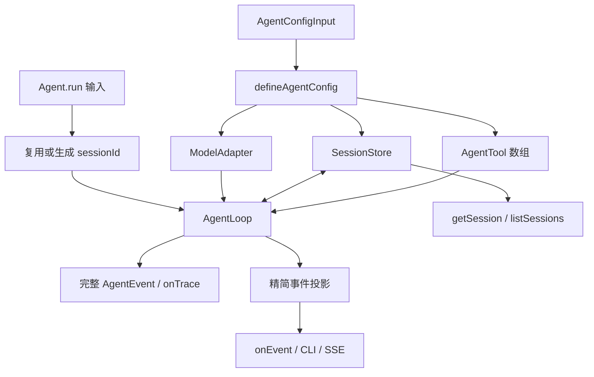
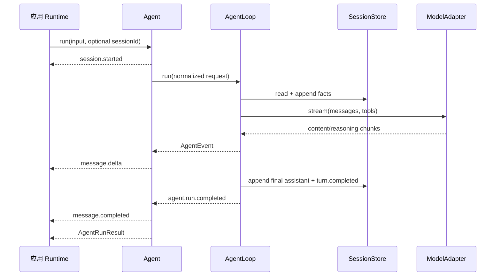

# CraftAgent 统一入口：从配置到会话查询

## 1. 学习目标

完成本篇后，你应该能解释：

- 为什么日常应用使用 `Agent`，底层测试和扩展仍保留 `AgentLoop`。
- `defineAgentConfig()`、`defineTools()` 分别解决什么问题。
- 精简输出事件与完整轨迹事件为什么必须分层。
- Session ID、事实日志和会话列表如何流转。

## 2. 模块地图

```text
src/craft-agent/agent/
  config.ts        # 模型配置、依赖注入、预算和默认值归一化
  define-tools.ts  # 异构 DefinedTool 的统一组装入口
  types.ts         # run 输入、精简输出和会话查询类型
  agent.ts         # AgentLoop 门面、事件投影和 Session 查询
  index.ts         # 本模块导出
```

推荐阅读顺序：`types.ts` → `config.ts` → `define-tools.ts` → `Agent.run()` →
`createOutputProjector()` → `listSessions()`。

## 3. 完整使用示例

```ts
import Agent, { defineTool, defineTools } from 'craft-agent'
import { z } from 'zod'

const echoTool = defineTool({
  name: 'echo',
  description: '返回输入文字。',
  inputSchema: z.strictObject({ text: z.string() }),
  outputSchema: z.strictObject({ text: z.string() }),
  security: { risk: 'safe', capabilities: [], idempotent: true },
  execute(input) {
    return input
  },
})

const agent = new Agent({
  model: {
    provider: 'openai-compatible',
    providerName: 'my-provider',
    apiKey: process.env.MODEL_API_KEY!,
    baseURL: 'https://example.com/v1',
    model: 'example-model',
  },
  tools: defineTools(echoTool),
  limits: { maxModelSteps: 8, maxToolCalls: 16 },
})

const result = await agent.run({ input: '复述 hello' }, {
  onEvent(event) {
    if (event.type === 'message.delta')
      process.stdout.write(event.delta)
  },
  onTrace(event) {
    console.debug(event.type, event.runId, event.sessionId)
  },
})

const session = await agent.getSession(result.sessionId)
const page = await agent.listSessions({ limit: 20 })
```

环境变量写在这段 Runtime 组装代码中，而不是 CraftAgent 内部。这样 CLI、Fastify、Worker 和测试可以
使用不同配置来源，Agent 本身不与部署方式耦合。

## 4. 数据流转图



重点是两条输出路径互不替代：应用 UI 通常只需要 `onEvent`，调试器需要 `onTrace`。轨迹暂时是实时接口，
可分页持久化轨迹仍在后续阶段。

## 5. 一次调用时序



## 6. 容易混淆的边界

- `defineAgentConfig()` 不是环境变量加载器；它只处理已经交给它的数据。
- `defineTools()` 不执行工具，也不绕过 `executeTool()`。
- `session.started` 表示本次 run 已确定 Session ID，不保证它此前不存在。
- `listSessions()` 来自 Store 目录，不维护第二份 Server 内存索引。
- `onEvent/onTrace` 是观察旁路，不能拿来修改控制流。
- 自定义 Store 可以只实现 `append/read`；这时 Agent 能运行，但不能列会话。

## 7. 练习

1. 使用 ScriptedModelAdapter 创建 Agent，并观察精简事件与完整轨迹数量差异。
2. 定义两个不同输入 Schema 的工具，通过一次 `defineTools()` 注册。
3. 连续向同一个 sessionId 发起两次 run，检查第二次模型输入包含第一轮历史。
4. 使用 `listSessions({ limit: 1 })` 和 `afterSessionId` 读取两页。

协议细节见[Agent 门面协议](../standards/protocols/agent.md)。
