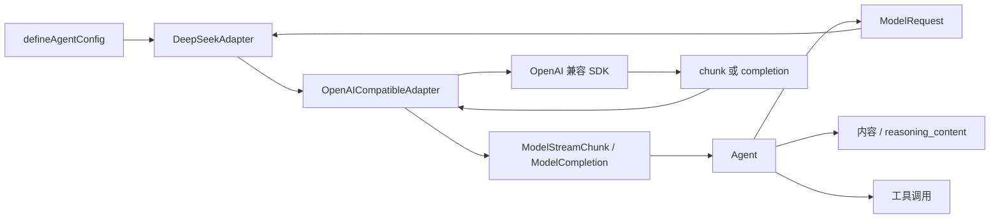

# ModelAdapter：从供应商 chunk 到 Agent

> 文档类型：学习指南；适用版本：阶段 2 及以后。

## 1. 学习目标

完成本指南后，你应该能够解释：

1. 为什么结构兼容 OpenAI 不等于让 Core 依赖 OpenAI SDK。
2. 通用 OpenAI Compatible Adapter 如何转换请求和 `ModelStreamChunk`。
3. `reasoning_content`、工具调用碎片、usage 和错误分别在哪里处理。
4. 为什么 Adapter 只分类错误而不自动重试。
5. 新增另一个模型供应商时应该修改哪些文件。

稳定协议以[模型 Adapter 规范](../standards/protocols/model-adapter.md)为准；本文只帮助理解实现。

## 2. 先看数据流



隔离边界不是“运行时对象绝不长得像 OpenAI”，而是 Core 不导入供应商 SDK，也不处理供应商连接、
鉴权和错误类。

## 3. 推荐源码阅读顺序

1. [`contracts/message.ts`](../../src/contracts/message.ts)：消息和完整工具调用。
2. [`contracts/model-events.ts`](../../src/contracts/model-events.ts)：标准 chunk 和增量。
3. [`contracts/model.ts`](../../src/contracts/model.ts)：请求、非流结果和 Adapter 接口。
4. [`contracts/model-errors.ts`](../../src/contracts/model-errors.ts)：稳定错误分类。
5. [`openai-compatible-model-adapter.ts`](../../src/adapters/openai-compatible/openai-compatible-model-adapter.ts)：
   兼容请求、响应、流和错误的公共实现。
6. [`deepseek-model-adapter.ts`](../../src/adapters/deepseek/deepseek-model-adapter.ts)：
   DeepSeek 差异层。
7. [`scripted-model-adapter.ts`](../../test/support/scripted-model-adapter.ts)：
   无网络测试实现。
8. [`agent/agent.ts`](../../src/agent/agent.ts)：标准 chunk 的消费者与应用事件投影。

## 4. “只增不减”如何工作

`ModelStreamChunk` 保留 OpenAI 的 `id`、`choices`、`delta`、`finish_reason`、`usage` 等字段。
DeepSeek 的 `reasoning_content` 和 craft-harness 的 `provider` 是新增字段。通用兼容层负责保留标准字段、
未知字段和 provider；DeepSeek 差异层只负责读取 `reasoning_content`。

Adapter 转换 chunk 时先展开原对象，再覆盖需要标准化的字段。因此未知的新字段在运行时仍然存在；
Core 只有在字段进入控制逻辑时才为它增加显式类型和测试。

## 5. 工具调用为什么仍需拼装

OpenAI 兼容流可能把一个工具调用拆成多个 delta：名称、ID 和 JSON 参数都可能分片。Adapter 负责把
供应商响应转换成统一 chunk，但 Agent 按 `index` 拼装完整调用，因为这就是标准 chunk 的通用语义。

拼装后参数仍是字符串：

```text
多个 arguments delta
  -> 完整 JSON 文本
  -> JSON.parse 得到 unknown
  -> 对应工具的 Zod inputSchema
  -> 已校验业务输入
```

## 6. DeepSeek 的 reasoning_content 回放与推理强度设置

携带工具的思考模式要求历史 assistant 消息保留 `reasoning_content`，空字符串也不能被遗漏。因此 Agent
把每个模型 Step 的 `reasoning_content` 与 assistant 消息一起保存，DeepSeek Adapter 再映射回供应商请求。

这项规则属于供应商适配行为；Agent 只认识内部可选字段，不读取 DeepSeek SDK 类型。

推理设置也按同一边界流转：应用在 Agent 配置的 `model.reasoningEffort` 提供默认值，或在请求的
`model.reasoningEffort` 中按次覆盖；门面只解析模型选择，同一个字符串原样进入 `ModelRequest.reasoningEffort`。
公共等级是开放字符串，Adapter 不做等级校验：非空字符串原样透传到供应商请求，部署配置只自查自己的默认
等级，供应商才是最终权威。

全链路只有这一根轴，所以 `'off'` 到供应商字段的翻译由每个 Adapter 各做一次，并且只做一次：DeepSeek 把它
翻译成 `thinking: { type: 'disabled' }`（不下发 `reasoning_effort`），OpenAI 兼容翻译成
`reasoning_effort: 'none'`。保留值来自 `contracts/model.ts` 的 `REASONING_OFF` 常量，Core 已在上游把
`'OFF'` 这类写法统一归一化为小写，Adapter 只需按小写字面量识别。内部契约里没有第二个维度，因此不存在
“关闭却同时指定等级”的状态，也不需要任何防御性互斥检查。

DeepSeek Adapter 因此只承载真实协议差异，不再持有 `'low' | 'high' | 'max'` 白名单。原因很直接：过期白名单
会在**合法输入上失败**（fail closed）——DeepSeek 新增一档等级时，旧版库会把合法请求判成
`MODEL_INVALID_REQUEST`，用户只能等库发版；而透传让供应商成为权威，真写错时供应商返回的 400 已由
`normalizeDeepSeekError()` 归类为同一个 `MODEL_INVALID_REQUEST`，错误信息比库里的旧枚举更准确。核心类型
不固定任何供应商取值，未来新增等级无需破坏性发布。

## 7. 流式与非流式不是同一种传输

```text
agent.stream() -> ModelAdapter.stream()   -> 多个 ModelStreamChunk
agent.invoke() -> ModelAdapter.complete() -> 一个 ModelCompletion
```

AgentLoop 会把两种结果归一化为同一个内部 Step，但轨迹保持真实来源：前者输出
`agent.model.chunk`，后者输出 `agent.model.completed`。应用选择非流式时直接等待最终
`AgentRunResult`；HTTP Runtime 应返回 JSON，而不是把完整结果切成一个伪 SSE 帧。

## 8. 三种扩展路径

- 只有 base URL、模型名和凭据不同：实例化 `OpenAICompatibleAdapter`，把模型名留给 Agent 的 `model.id`。
- Chat Completions 兼容但存在少量字段差异：继承通用 Adapter 的 protected 模板方法。
- 原生协议结构不同：直接实现 `ModelAdapter`，完整转换到内部协议。

不要为了复用而把非兼容协议伪装成兼容服务。具体实现和测试步骤见
[自定义模型 Adapter 开发实践](./custom-model-adapter.md)。

## 9. 配置和错误

`defineAgentConfig()` 归一化唯一配置根。调用方显式注入 Adapter，配置根把连接对象与默认模型选择放在一起，
但不替调用方创建供应商实现。
Adapter 将 SDK 异常转成 `ModelError`，但不会重试；否则重试次数、时间和 token 消耗无法被未来的
Agent Loop 统一预算。

Agent 的 `model.id` 是必填部署配置：库不内置默认模型名。Adapter 不持有模型，因此同一个实例可以在
不同请求间切换模型；`baseURL` 是连接配置，DeepSeek Adapter 仍默认 `https://api.deepseek.com`。

## 10. 从测试反推设计

库测试在 `test/`，案例测试在 `sample/test/`：

- [`test/openai-compatible-adapter.test.ts`](../../test/openai-compatible-adapter.test.ts)：通用映射和流错误。
- [`test/deepseek-adapter.test.ts`](../../test/deepseek-adapter.test.ts)：请求、响应、扩展字段和错误映射。
- [`test/model-adapter-testing.test.ts`](../../test/model-adapter-testing.test.ts)：Scripted Adapter 和契约探针。
- [`sample/test/agent-model-adapter.test.ts`](../../sample/test/agent-model-adapter.test.ts)：Agent 只消费标准协议。
- [`test/model-boundary.test.ts`](../../test/model-boundary.test.ts)：防止 SDK 类型回流 Core，并守住库对案例的依赖方向。
- [`test/agent-config.test.ts`](../../test/agent-config.test.ts)：统一配置根。

建议练习：实现一个只使用固定 mock 响应的 Adapter，分别返回普通文本、分片工具调用和协议错误；如果
不修改 `Agent` 就能通过现有契约测试，说明边界基本正确。
