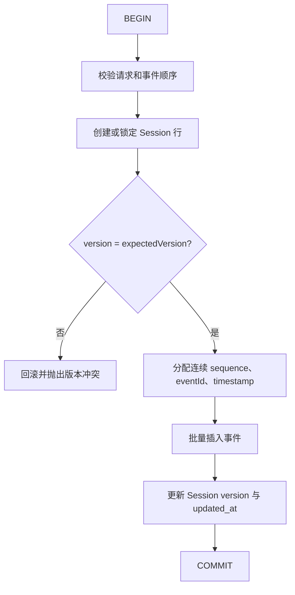

# 持久化 SessionStore：从内存调试到 PostgreSQL

> 文档类型：学习教程；示例数据库：PostgreSQL；适用范围：Node.js Runtime。

## 1. 学习目标

完成本教程后，你应该能够：

- 判断何时使用 `MemorySessionStore`，何时必须接入持久化 Store。
- 为 append-only Session Log 设计关系数据库表。
- 正确实现原子追加、乐观并发和固定版本分页。
- 将数据库异常转换为 CraftAgent 的稳定错误。
- 使用契约探针验证自己的 Store。
- 在不修改 CraftAgent 用户模型的前提下保存 `userId`、`tenantId` 等应用字段。

前置阅读：

- [Session Log 学习指南](./session-log.md)
- [Session Log 协议](../standards/protocols/session-log.md)
- [外部持久化 ADR](../product/decisions/adr-0007-session-store-persistence-port.md)

## 2. 先明确边界

CraftAgent 只定义会话存储的行为，不负责数据库连接和用户系统：

```text
HTTP / CLI / Worker Runtime
  ├── 身份认证、权限判断、连接池生命周期
  ├── 构造应用自己的 SessionStore
  └── new Agent({ model, session: { store } })
                         │
                         ▼
                    AgentLoop
                         │
                         ▼
                  SessionStore Port
                         │
              ┌──────────┴──────────┐
              ▼                     ▼
       PostgreSQL / ORM       业务 Service / API
```

Store 不是模型工具。模型不能选择数据库、拼接 SQL，也不能直接修改 Session 历史。

## 3. 是否应该删除 MemorySessionStore

不应该。`MemorySessionStore` 有三个明确用途：

- 让 `new Agent({ model })` 可以零数据库启动。
- 为单元测试和学习示例提供确定性实现。
- 作为第三方 Store 的协议行为参考。

它不是生产持久化方案：数据只存在于当前 Node.js 进程，重启后全部丢失，而且默认不会过期或驱逐 Session。
长期运行的服务应显式注入持久化 Store。CraftAgent 不在内存实现中加入 LRU、TTL、落盘或分布式同步；这些属于
具体存储实现的选择。

无数据库调试可以直接使用默认值：

```ts
import Agent from '../../src/craft-agent'

const agent = new Agent({ model })
```

需要直接观察事件时，可以显式创建 Store：

```ts
import Agent, { MemorySessionStore } from '../../src/craft-agent'

const store = new MemorySessionStore()
const agent = new Agent({ model, session: { store } })

await agent.run({ sessionId: 'learning-session', input: '你好' })
console.dir(await store.read('learning-session'), { depth: null })
```

## 4. 必须实现的协议

只执行 Agent，需要实现 `SessionStore`：

```ts
interface SessionStore {
  append: (request: AppendSessionEventsRequest) => Promise<AppendSessionEventsResult>
  read: (
    sessionId: string,
    options?: ReadSessionEventsOptions,
  ) => Promise<SessionEventPage>
}
```

还要支持 `agent.listSessions()`，则实现 `SessionCatalogStore`：

```ts
interface SessionCatalogStore extends SessionStore {
  list: (options?: ListSessionsOptions) => Promise<SessionListPage>
}
```

这里的重点不是方法名称，而是以下不变量：

- 一个 Session 的 `sequence` 从 1 开始，严格递增且没有空洞。
- 一批 `append()` 要么全部成功，要么完全不写入。
- `expectedVersion` 必须与数据库当前版本相等。
- 首次批次必须以唯一的 `session.created` 开始。
- 返回事件必须是可序列化的 JSON 数据，不能保留调用方对象引用。
- 多页读取必须固定 `throughVersion`，不能混入翻页期间新增的事件。

## 5. PostgreSQL 表结构

CraftAgent 的 ID 是字符串，教程使用 `text`，不强制调用方只能使用 UUID。`bigint` 可以承载长期增长的版本和
序号；Node.js 驱动通常把 PostgreSQL `bigint` 返回为字符串，转换为 `number` 时必须检查
`Number.isSafeInteger()`。

### 5.1 Session 目录表

```sql
CREATE TABLE craft_agent_sessions (
  session_id    text PRIMARY KEY,
  catalog_order bigint GENERATED ALWAYS AS IDENTITY UNIQUE,
  version       bigint NOT NULL DEFAULT 0 CHECK (version >= 0),
  metadata_json jsonb,
  created_at    timestamptz NOT NULL,
  updated_at    timestamptz NOT NULL
);

CREATE INDEX craft_agent_sessions_created_idx
  ON craft_agent_sessions (catalog_order);
```

字段说明：

| 字段            | 用途                                                                     |
| --------------- | ------------------------------------------------------------------------ |
| `session_id`    | CraftAgent 的 Session ID，也是事件表外键。                               |
| `catalog_order` | 稳定的创建顺序，用于实现 `list()` 游标分页。事务回滚造成空洞不影响语义。 |
| `version`       | 当前最后一个事件的 sequence；新 Session 初始为 0。                       |
| `metadata_json` | `session.created.metadata` 的目录投影。                                  |
| `created_at`    | 首次创建时间。                                                           |
| `updated_at`    | 最近一次成功追加时间。                                                   |

### 5.2 Session 事件表

```sql
CREATE TABLE craft_agent_session_events (
  session_id  text NOT NULL
              REFERENCES craft_agent_sessions(session_id),
  sequence    bigint NOT NULL CHECK (sequence > 0),
  event_id    text NOT NULL UNIQUE,
  event_type  varchar(64) NOT NULL,
  run_id      text,
  turn_id     text,
  payload_json jsonb NOT NULL,
  created_at  timestamptz NOT NULL,
  PRIMARY KEY (session_id, sequence)
);

CREATE INDEX craft_agent_session_events_run_idx
  ON craft_agent_session_events (run_id)
  WHERE run_id IS NOT NULL;
```

`payload_json` 保存事件特有字段：

- `session.created`：`metadata`。
- `message.appended`：`message`。
- `turn.failed`：`error`。
- `turn.cancelled`：`reason`。

`eventId`、`sessionId`、`sequence`、`timestamp` 和 `type` 已有稳定列，不必再次复制进 payload。读取时将列与
payload 合并成 `SessionEvent`。

不要建立可变的 `messages` 表作为第二份权威历史。模型消息应继续从 `message.appended` 事件确定性推导。

## 6. append() 的事务流程

一次追加必须位于同一个数据库事务：



关键 SQL 结构如下，具体占位符和批量插入方式由数据库驱动决定：

```sql
BEGIN;

-- 新 Session 可以先 INSERT ... ON CONFLICT DO NOTHING，随后统一加行锁。
SELECT version
FROM craft_agent_sessions
WHERE session_id = $1
FOR UPDATE;

-- 应用代码比较 version 和 expectedVersion。

INSERT INTO craft_agent_session_events (
  session_id, sequence, event_id, event_type,
  run_id, turn_id, payload_json, created_at
)
VALUES (...), (...);

UPDATE craft_agent_sessions
SET version = $2,
    updated_at = $3
WHERE session_id = $1;

COMMIT;
```

不能先更新 `version` 再在另一个事务写事件，也不能用 Node.js 进程锁代替数据库行锁。多实例部署时只有数据库
事务或等价的 compare-and-swap 才能保护版本。

版本不一致时应抛出：

```ts
throw new SessionStoreError({
  code: 'SESSION_VERSION_CONFLICT',
  message: `Session ${sessionId} 版本冲突`,
  sessionId,
  expectedVersion: request.expectedVersion,
  actualVersion,
})
```

## 7. read() 的固定快照分页

第一次读取没有 `throughVersion` 时：

1. 查询 Session 当前 `version`，记为 `snapshotVersion`。
2. 只读取 `sequence <= snapshotVersion` 的事件。
3. 多取一条判断 `hasMore`。

```sql
SELECT sequence, event_id, event_type, run_id, turn_id,
       payload_json, created_at
FROM craft_agent_session_events
WHERE session_id = $1
  AND sequence > $2
  AND sequence <= $3
ORDER BY sequence ASC
LIMIT $4;
```

后续页面必须继续使用第一页返回的 `snapshotVersion` 作为 `throughVersion`。`latestVersion` 可以反映数据库
此刻的新版本，但页面不能把新增事件混入旧快照。

不存在的 Session 应返回零版本空页，不应该把普通“未创建”映射为数据库异常：

```ts
const emptyPage = {
  sessionId,
  snapshotVersion: 0,
  latestVersion: 0,
  events: [],
  hasMore: false,
  nextAfterSequence: 0,
}
```

## 8. list() 的稳定目录分页

当前协议使用上一页最后一个 `sessionId` 作为游标。数据库实现应先查询该 Session 的
`catalog_order`；游标不存在时抛出 `SESSION_INVALID_ARGUMENT`，未提供游标时使用 0。随后读取后续条目：

```sql
SELECT session_id, version, metadata_json, created_at
FROM craft_agent_sessions
WHERE catalog_order > $1
ORDER BY catalog_order ASC
LIMIT $2;
```

和事件分页一样，可以多取一条计算 `hasMore`。返回给 CraftAgent 的 `createdAt` 必须是 ISO 8601 字符串。

## 9. 实现骨架

数据库驱动、ORM 和事务 API 各不相同，因此 CraftAgent 不提供绑定 `pg` 的基类。应用实现的结构通常如下：

```ts
import type {
  AppendSessionEventsRequest,
  AppendSessionEventsResult,
  ListSessionsOptions,
  ReadSessionEventsOptions,
  SessionCatalogStore,
  SessionEventPage,
  SessionListPage,
} from 'craft-agent'
import { SessionStoreError } from 'craft-agent'

/** 使用应用连接池实现的 PostgreSQL Session Store。 */
export class PostgresSessionStore implements SessionCatalogStore {
  constructor(private readonly database: AppDatabase) {}

  /** 在单个事务内执行版本比较、批量插入和版本推进。 */
  async append(
    request: AppendSessionEventsRequest,
  ): Promise<AppendSessionEventsResult> {
    try {
      return await this.database.transaction(async (transaction) => {
        // 1. 校验输入与初始化事件。
        // 2. 创建或 SELECT ... FOR UPDATE 锁定 Session。
        // 3. 比较 expectedVersion。
        // 4. 批量插入连续事件。
        // 5. 更新 version 并返回数据库实际保存的事件。
        return await appendSessionEvents(transaction, request)
      })
    }
    catch (error) {
      if (error instanceof SessionStoreError)
        throw error
      throw new SessionStoreError({
        code: 'SESSION_OPERATION_FAILED',
        message: 'Session 事件写入失败',
        sessionId: request.sessionId,
        operation: 'append',
        cause: error,
      })
    }
  }

  /** 从数据库直接读取固定版本事件页，不复制到 MemorySessionStore。 */
  async read(
    sessionId: string,
    options: ReadSessionEventsOptions = {},
  ): Promise<SessionEventPage> {
    try {
      return await readSessionEventPage(this.database, sessionId, options)
    }
    catch (error) {
      if (error instanceof SessionStoreError)
        throw error
      throw new SessionStoreError({
        code: 'SESSION_OPERATION_FAILED',
        message: 'Session 事件读取失败',
        sessionId,
        operation: 'read',
        cause: error,
      })
    }
  }

  /** 按稳定创建顺序读取 Session 目录。 */
  async list(options: ListSessionsOptions = {}): Promise<SessionListPage> {
    try {
      return await listSessionPage(this.database, options)
    }
    catch (error) {
      if (error instanceof SessionStoreError)
        throw error
      throw new SessionStoreError({
        code: 'SESSION_OPERATION_FAILED',
        message: 'Session 目录读取失败',
        operation: 'list',
        cause: error,
      })
    }
  }
}
```

示例中的 `AppDatabase`、`appendSessionEvents()`、`readSessionEventPage()` 和 `listSessionPage()` 由应用根据
`pg`、Prisma、Drizzle、TypeORM 或已有数据库 Service 实现。不要让这些类型进入 CraftAgent Core。

## 10. 保存应用用户信息

CraftAgent 不定义 `User`、`Role`、`Tenant` 或权限协议。Runtime 可以在创建 Session 时传入应用字段：

```ts
await agent.run({
  input: '你好',
  sessionMetadata: {
    userId: authenticatedUser.id,
    tenantId: authenticatedUser.tenantId,
    source: 'web',
  },
})
```

Store 可以把 metadata 原样保存在 `metadata_json`，也可以提取常用字段到应用自己的列：

```sql
ALTER TABLE craft_agent_sessions
  ADD COLUMN app_user_id text,
  ADD COLUMN app_tenant_id text;

CREATE INDEX craft_agent_sessions_app_user_idx
  ON craft_agent_sessions (app_tenant_id, app_user_id, catalog_order);
```

这些列不是 CraftAgent 标准。具体 Store 还可以公开 Agent 不使用的业务方法：

```ts
/** 应用 Store 可以在标准协议之外提供用户会话查询。 */
class AppSessionStore implements SessionCatalogStore {
  // append/read/list 供 CraftAgent 使用。

  async listByUser(tenantId: string, userId: string) {
    // 供 Fastify、管理后台或业务 Service 使用。
  }

  async assertUserAccess(userId: string, sessionId: string) {
    // 权限规则由应用决定，不由 Agent 或模型决定。
  }
}
```

不要直接相信请求体中的 `userId`。Runtime 应先完成身份认证，再把可信身份写入 metadata 或交给业务 Store。
Session 所有者变更、成员管理和权限判断也不应该通过 Agent 对话修改。

## 11. 运行契约测试

实现完成后，必须对隔离数据库运行 CraftAgent 的契约探针：

```ts
import { assertSessionStoreContract } from '../../test/support/session-store-contract'

await assertSessionStoreContract(store, {
  sessionIdPrefix: `postgres-test-${Date.now()}`,
  requireCatalog: true,
})
```

探针会真实写入多个 Session，而且协议没有删除方法。测试应使用临时数据库、临时 schema、事务夹具或测试容器，
不能连接生产库。

`test/support` 是本仓库的测试支持目录，不是 CraftAgent 公共子路径。项目外开发者应将协议中的行为清单写成
自己测试框架下的契约测试，而不是让生产代码依赖 CraftAgent 的内部测试夹具。

通用探针之外，SQL Store 还应测试：

- 两个连接并发追加同一版本时，只允许一个成功。
- 任一事件插入失败时，Session version 和整批事件都回滚。
- `bigint` 超出 JavaScript 安全整数时明确失败。
- 驱动断连、超时和唯一约束异常映射为正确错误码。
- metadata 与事件 payload 的 JSON 序列化边界。
- 多页读取期间发生新追加时，固定快照不漂移。

## 12. 持久化不等于上下文压缩

数据库 Store 解决进程内常驻数据增长和重启丢失，但不会自动降低模型上下文：当前 Agent 仍会从 Session 事件
推导完整模型历史。长期会话还需要未来的 ContextBuilder 或摘要投影，根据 token 预算组合“历史摘要 + 最近完整
Turn”，同时继续保留数据库中的完整事件事实。

在该能力实现前，应用应设置合理的 Session 生命周期和 Agent token 预算，不要通过删除中间 Tool Call、只保留
最后几条消息等方式破坏历史结构。

## 13. 本项目的 PostgreSQL 参考实现

本地已经创建 PostgreSQL 数据库 `craft_agent_dev`，其中包含：

- `craft_agent_sessions`
- `craft_agent_session_events`

仓库内对应文件：

```text
database/migrations/001-create-session-log.sql
src/server/database/postgres.ts
src/server/database/migrate.ts
src/server/database/check.ts
src/server/stores/postgres-session-store.ts
test/postgres-session-store.contract.ts
```

先将 `.env.example` 中的数据库配置复制到被 Git 忽略的 `.env.local`，并填写本地真实密码。随后可以运行：

```bash
pnpm db:migrate
pnpm db:check
pnpm db:test-store
```

迁移可以重复执行；连接检查只输出数据库名、PostgreSQL 版本和表是否存在，不输出连接字符串或密码。
契约命令会创建独立临时 schema，验证完成后自动删除，不会把测试 Session 写进开发目录。

### 13.1 当前实现的阅读顺序

[postgres-session-store.ts](../../src/server/stores/postgres-session-store.ts) 是可运行的 `pg` 参考实现。建议按数据流
而不是按文件行号阅读：

1. 从 `read()` 观察“数据库行 → SessionEvent → 固定快照页”。
2. 阅读 `list()`，比较摘要目录为何不查询事件表。
3. 阅读 `append()` 的 `BEGIN → INSERT/锁行 → 比较版本 → 插入事件 → 更新版本 → COMMIT`。
4. 阅读 `createEventPayload()` 与 `restoreEvent()`，理解列和 JSON payload 如何组合为判别联合。
5. 阅读契约测试中的并发探针，观察两个相同 `expectedVersion` 为什么只能成功一个。

你最值得亲手完成的验证是：在页面连续进行 10 轮对话，停止并重启 Node 服务，再进行第 11 轮；随后直接查询
两张表，对照 `version`、`sequence`、`turn_id` 和 `payload_json`。原始学习草稿保存在
`docs/learning/drafts/postgres-session-store-attempt.ts.txt`，可以与正式实现逐段比较。

实现过程中优先使用以下现有代码作为行为参考：

- [memory-session-store.ts](../../src/craft-agent/sessions/memory-session-store.ts)：事件校验、分页结果和错误语义。
- [session-store-contract.ts](../../test/support/session-store-contract.ts)：本仓库 Store 必须通过的内部行为断言。
- [Session Log 协议](../standards/protocols/session-log.md)：持久化不变量。

## 14. 完成检查表

- [x] Runtime 管理数据库连接池，CraftAgent 只接收 Store 对象。
- [x] `append()` 在一个事务中完成全部写入和版本推进。
- [x] 数据库约束保证 `(session_id, sequence)` 与 `event_id` 唯一。
- [x] `read()` 支持固定 `throughVersion` 分页。
- [x] `list()` 使用稳定创建顺序，而不是易变化的更新时间。
- [x] 驱动异常被包装为 `SessionStoreError`，公开消息不泄露 SQL 和连接信息。
- [x] 用户字段属于应用扩展，不进入 CraftAgent 用户或权限模型。
- [x] Store 已通过契约探针和数据库专项并发测试。
- [x] Server Agent 显式注入持久化 Store，不依赖默认内存数据。
