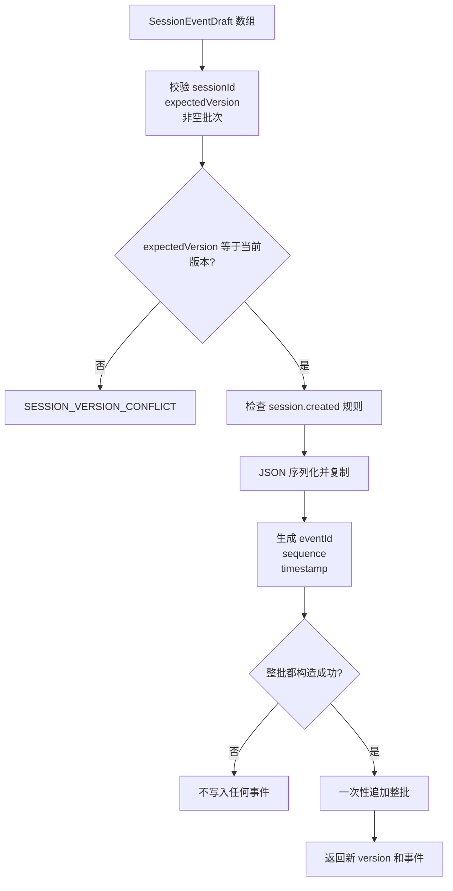

# Session Log：从可变消息数组到事实日志

## 1. 前置知识

阅读前建议先理解：

- [Tool Harness](./tool-harness.md) 中的模型消息与工具结果。
- [ModelAdapter](./model-adapter.md) 中的 `ModelMessage`。
- [Session Log 当前规范](../standards/protocols/session-log.md)。

## 2. 学习目标

完成本篇后，你应该能够解释：

1. 为什么 Session Log 不是简单的 `messages.push()`。
2. `SessionEventDraft` 和 `SessionEvent` 有什么区别。
3. `expectedVersion` 如何阻止并发覆盖。
4. 为什么多页读取需要固定 `throughVersion`。
5. 模型历史怎样从事件确定性恢复。
6. 内存 Store 与未来数据库 Store 必须共享哪些不变量。

## 3. 核心心智模型

可变数组记录“现在是什么”：

```ts
conversation.history = newMessages
```

append-only 日志记录“发生过什么”：

```text
1 session.created
2 message.appended   system
3 turn.started       turn-1
4 message.appended   user
5 message.appended   assistant(tool_calls)
6 message.appended   tool
7 message.appended   assistant(final)
8 turn.completed     turn-1
```

前者被覆盖后无法知道旧状态；后者可以重放、审计并恢复模型上下文。

## 4. 模块地图

```text
src/craft-agent/
  contracts/
    session.ts                 # Event、分页、Store 接口
  sessions/
    errors.ts                  # 稳定 Session 错误
    memory-session-store.ts    # 内存 append-only 实现
    derive-messages.ts         # 快照读取和模型消息推导
    index.ts                   # Session 模块导出
```

推荐阅读顺序：

1. `contracts/session.ts`
2. `sessions/errors.ts`
3. `sessions/memory-session-store.ts` 的 `append()`
4. 同文件的 `read()`
5. `sessions/derive-messages.ts`
6. `test/session-log.test.ts`

## 5. 写入数据如何流转



关键点是内部状态只在最后的 Commit 步骤变化。序列化失败、ID 冲突或时钟无效都不会留下半批事件。

## 6. 第一次创建 Session

```ts
import { MemorySessionStore } from '../../src/craft-agent'

const store = new MemorySessionStore()

const created = await store.append({
  sessionId: 'session-1',
  expectedVersion: 0,
  events: [
    {
      type: 'session.created',
      metadata: { channel: 'local-test' },
    },
    {
      type: 'message.appended',
      message: {
        role: 'system',
        content: '你是一个 AI 助手。',
      },
    },
  ],
})

console.log(created.version) // 2
```

为什么调用方只提供 Draft：

- 调用方知道“发生了什么”。
- Store 才知道事件最终写入的顺序和时间。
- 禁止调用方自己填写 sequence，避免两个 Writer 生成相同顺序。

## 7. 追加一次 Turn

假设上一批返回 `version=2`：

```ts
const turn = await store.append({
  sessionId: 'session-1',
  expectedVersion: 2,
  events: [
    {
      type: 'turn.started',
      runId: 'run-1',
      turnId: 'turn-1',
    },
    {
      type: 'message.appended',
      runId: 'run-1',
      turnId: 'turn-1',
      message: { role: 'user', content: '杭州天气怎么样？' },
    },
  ],
})

console.log(turn.version) // 4
```

后续模型消息、工具结果和最终回答继续用 `expectedVersion=4`、`5` 等版本追加。

## 8. 理解版本冲突

两个请求都读到 version 4：

```text
Writer A 基于消息 1..4 请求模型
Writer B 也基于消息 1..4 请求模型
Writer A 先追加结果，Session 变成 version 5
Writer B 再用 expectedVersion=4 追加
```

Writer B 必须失败。若 Store 自动把它追加成 sequence 6，它的结果实际上没有看到 sequence 5，模型历史就会出现
因果关系错误。

正确处理是由 Agent Loop 识别为 `session_error`；当前不会自动重新调用模型，因为模型流或工具副作用可能已经发生，
不能由 Store 擅自重放。

## 9. 读取固定快照

```ts
import { readSessionSnapshot } from '../../src/craft-agent'

const snapshot = await readSessionSnapshot('session-1', store, {
  pageSize: 100,
})
```

第一页确定 `snapshotVersion`，后续页面固定读取到这个版本。即使读取期间继续追加，新事件也只会出现在下一次快照。

这避免得到类似下面的移动目标：

```text
读取第一页时 Session 有 200 条
读取第二页前又追加 10 条
调用方误以为 210 条属于同一次历史快照
```

## 10. 推导模型历史

```ts
import { loadModelMessages } from '../../src/craft-agent'

const messages = await loadModelMessages('session-1', store)
```

内部过程：

```text
readSessionSnapshot()
  -> 验证完整 sequence
  -> 过滤 message.appended
  -> 保持原顺序返回 ModelMessage[]
```

`session.created`、`turn.started` 和 `turn.completed` 不会发送给模型，但仍保留在日志中用于恢复和审计。

## 11. 工具调用如何进入历史

工具调用不需要 Session Log 发明新的模型消息格式：

```text
message.appended: assistant + tool_calls
message.appended: role=tool + tool_call_id + content
message.appended: assistant 最终回答
```

这样 `deriveModelMessages()` 得到的历史可以直接交给 ModelAdapter，同时工具执行过程的 attempt/retry 轨迹仍属于
独立 Tool Event，不污染模型上下文。

## 12. Memory Store 为什么复制并冻结

下面的调用方代码不能改变已经追加的事实：

```ts
const metadata = { source: 'before' }

await store.append({
  sessionId: 'session-2',
  expectedVersion: 0,
  events: [{ type: 'session.created', metadata }],
})

metadata.source = 'after'
```

Store 写入的是 JSON 副本，并冻结内部事件。否则 append-only 只是接口名字，调用方仍能通过对象引用修改历史。

## 13. 建议断点

调试 `MemorySessionStore.append()` 时依次观察：

```text
request.expectedVersion
currentVersion
drafts
batchIds
appended[].sequence
nextEvents
```

调试分页时观察：

```text
afterSequence
snapshotVersion
latestVersion
nextAfterSequence
hasMore
```

## 14. 练习

1. 创建 Session，并把 system/user/assistant 三条消息写入后推导出来。
2. 使用旧 `expectedVersion` 追加，确认没有任何部分写入。
3. 把分页大小设为 1，并在读取中途追加事件，确认快照不变化。
4. 在 metadata 中放入循环引用，确认 Store 返回序列化错误。
5. 构造 sequence 不连续的事件数组，确认推导函数拒绝而不是自动排序。
6. 写一个只依赖 `SessionStore` 接口的函数，证明它不需要知道数据在内存还是数据库。

## 15. Agent Loop 如何使用 Session Log

Session Log 只提供事实和持久化语义，不控制模型循环。当前 Agent Loop 负责：

```text
读取 Session 快照
  -> 追加 turn.started 和用户消息
  -> 调用 ModelAdapter
  -> 执行 Tool Harness
  -> 追加 assistant/tool 消息
  -> 追加 turn.completed / failed / cancelled
```

Agent Loop 不会重新维护一份长期可变消息数组；每个模型请求的历史都由 Session Log 推导。完整流程见
[Agent Loop 学习指南](./agent-loop.md)。

## 16. 如何实现持久化 Store

持久化实现不是 Agent Tool，而是注入 Agent 的基础设施 Adapter：

```ts
class ServiceSessionStore implements SessionStore {
  constructor(private readonly service: SessionService) {}

  async append(request: AppendSessionEventsRequest) {
    try {
      return await this.service.appendEvents(request)
    }
    catch (cause) {
      throw new SessionStoreError({
        code: 'SESSION_OPERATION_FAILED',
        message: 'Session 写入失败',
        sessionId: request.sessionId,
        operation: 'append',
        cause,
      })
    }
  }

  async read(sessionId: string, options?: ReadSessionEventsOptions) {
    return await this.service.readEvents(sessionId, options)
  }
}

const agent = new Agent({ model, store: new ServiceSessionStore(service) })
```

`service` 可以在内部使用原生 SQL、ORM 或 HTTP API。Agent 不需要知道其实现，也不需要调用 `initialize()`
把历史复制到内存。连接和迁移在 Runtime 启动阶段完成，关闭连接则由 Runtime 的退出流程负责。

实现完成后先运行契约探针：

```ts
import { assertSessionStoreContract } from '../src/craft-agent/sessions/testing'

await assertSessionStoreContract(store, {
  sessionIdPrefix: 'temporary-test-run',
  requireCatalog: true,
})
```

探针会写数据且 Session Log 没有删除接口，因此应使用临时数据库、测试 schema 或可整体销毁的测试容器。
SQL 事务结构、远程重试和错误映射要求见[Session Log 协议](../standards/protocols/session-log.md)。
