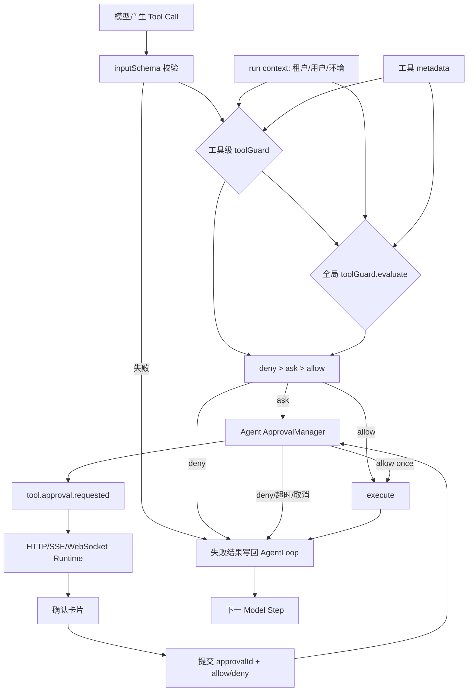
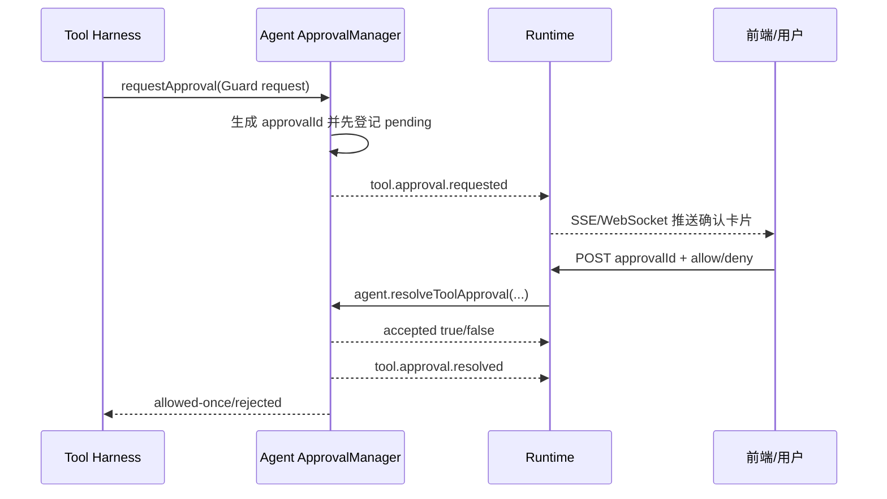

# 工具审批全链路：局部 Guard、全局 Guard 与用户确认

> 文档类型：学习文档；当前实现以可信第一方工具为前提。

## 1. 最重要的心智模型

CraftAgent 把“判断风险”和“等待用户”拆开：

- 开发者只实现评估函数，返回 `allow`、`deny` 或 `ask`。
- Agent 实例固定实现审批 ID、等待、超时、取消和重复提交控制。
- Runtime 只把 Agent 标准事件送往前端，并把用户决定交回同一个 Agent 实例。
- AgentLoop 不理解按钮或 HTTP。它只看到工具成功或失败，再把结果写回模型。

`deny` 不终止整个 AgentLoop。它只拒绝本次工具调用；模型会收到明确的工具失败消息，并有机会解释、
改用别的工具或给出普通回答。

## 2. 四个参与层

| 层         | 负责什么                                         | 不负责什么                |
| ---------- | ------------------------------------------------ | ------------------------- |
| 工具定义   | Schema、metadata、局部 Guard、执行策略和业务实现 | 用户登录、页面传输        |
| CraftAgent | 两层 Guard 合并、审批生命周期、AgentLoop         | Fastify、数据库用户表、UI |
| Runtime    | 从可信认证结果构造 context；转发事件和决定       | 重写审批状态机            |
| 前端/CLI   | 展示 ask/deny；提交 approvalId 与决定            | 直接执行工具              |

## 3. 完整数据流



## 4. 定义工具自己的规则

工具级 Guard 适合只由工具和参数决定的规则。下面的 read 自动允许，write 询问用户，受保护资源删除自动
拒绝：

```ts
const resourceTool = defineTool({
  name: 'manage_resource',
  description: '读取、写入或删除资源。',
  inputSchema: z.strictObject({
    operation: z.enum(['read', 'write', 'delete']),
    resource: z.string(),
    content: z.string().nullable(),
  }),
  outputSchema: z.strictObject({ ok: z.boolean() }),
  metadata: {
    risk: 'destructive',
    capabilities: ['resource:manage'],
  },
  toolGuard(request) {
    const { operation, resource } = request.input
    if (operation === 'read')
      return { decision: 'allow' }
    if (operation === 'delete' && resource.startsWith('protected/')) {
      return {
        decision: 'deny',
        reason: `受保护资源 ${resource} 禁止删除`,
      }
    }
    return {
      decision: 'ask',
      reason: `工具将${operation === 'write' ? '写入' : '删除'} ${resource}`,
      title: '确认资源操作',
      details: { operation, resource },
      approvalTimeoutMs: 45_000,
    }
  },
  execute(input) {
    // 只有最终决定 allow 或用户 allowed-once 才能到达这里。
    return { ok: true }
  },
})
```

`metadata` 的字段完全由应用定义。CraftAgent 只要求它是 JSON 对象，不会自动理解 `risk` 或
`capabilities`。

## 5. 用全局 Guard 判断租户、用户和环境

先定义当前应用的运行上下文：

```ts
interface AppRunContext {
  tenantId: string
  user: {
    id: string
    roles: readonly string[]
  }
  permissions: readonly string[]
  environment: 'development' | 'staging' | 'production'
}
```

再把这个类型交给 Agent：

```ts
const agent = new Agent<AppRunContext>({
  model,
  tools: { additional: [resourceTool] },
  toolGuard: {
    approvalTimeoutMs: 120_000,
    evaluate(request) {
      // 工具信息、已校验参数和当前可信请求上下文都在同一个输入中。
      if (!request.context.tenantId || !request.context.user.id) {
        return { decision: 'deny', reason: '缺少可信身份上下文' }
      }
      if (request.context.environment === 'production'
        && !request.context.permissions.includes('tools:execute')) {
        return { decision: 'deny', reason: '当前用户没有生产环境工具权限' }
      }
      return { decision: 'allow' }
    },
  },
})
```

每次请求从认证结果构造 context：

```ts
fastify.post('/api/chat', async (request, reply) => {
  const identity = await authenticate(request) // 服务端验证 Token/Session

  return await agent.run({
    input: request.body.message,
    sessionId: request.body.sessionId,
    context: {
      tenantId: identity.tenantId,
      user: { id: identity.userId, roles: identity.roles },
      permissions: identity.permissions,
      environment: process.env.NODE_ENV === 'production'
        ? 'production'
        : 'development',
    },
  }, {
    onEvent: event => sendToClient(event),
  })
})
```

不要直接相信浏览器提交的 `tenantId`、角色或权限。浏览器可以提交业务输入，但 Runtime 必须从已经认证的
服务端状态构造 context。

### context 的生命周期

```text
认证结果
  -> agent.run({ context })
     -> AgentLoop 当前 Run
        -> 工具级 Guard
        -> 全局 Guard
        -> 每次 execute 的 ToolRunContext.context
  -> Run 结束后释放引用
```

它不会进入：

- 模型 messages 或工具 JSON Schema；
- Session Log；
- AgentOutputEvent；
- Agent 单例字段；
- 下一位用户的 Run。

如果希望把用户信息写入业务数据库，应由工具通过 `context` 传给自己的 Store；如果希望记录审计信息，
应在后续 Trace/Diagnostic 适配层显式脱敏后处理。

## 6. 两层结果如何合并

两层都配置时总会先运行工具级，再运行全局级：

| 工具级       | 全局级       | 最终结果              |
| ------------ | ------------ | --------------------- |
| 缺省/allow   | 缺省/allow   | allow                 |
| ask          | allow        | ask                   |
| allow        | ask          | ask                   |
| ask          | ask          | ask，有限时限取较小值 |
| deny         | 任意有效结果 | deny                  |
| 任意有效结果 | deny         | deny                  |

两层都缺省不是错误，而是直接允许。这适合当前“工具由可信开发者静态注册”的阶段。需要统一部署约束时才配置
全局 Guard，需要参数级规则时才配置工具 Guard。

任一评估器抛错或返回非法决定时，CraftAgent 返回 `TOOL_GUARD_FAILED`，不会把异常降级成 allow。

## 7. ask 以后 Agent 内部发生什么



“先登记 pending，再发送 requested”很重要：即使 UI 极快返回，也不会发生决定先于等待项创建的竞态。

### requested 标准事件

```ts
const event = {
  type: 'tool.approval.requested',
  sessionId,
  runId,
  approvalId,
  callId,
  toolName,
  reason,
  title,
  details,
  input,
  toolMetadata,
  approvalTimeoutMs,
  requestedAt,
  expiresAt,
}
```

`toolMetadata` 是原工具 metadata，前端可以选择展示自己认识的字段。它不应被当作服务端授权证明。

### 审批时限

优先级为：

```text
两层 ask 合并后的最严格单次值
  > Agent toolGuard.approvalTimeoutMs
  > 默认 120 秒
```

- 正整数：毫秒时限，事件携带绝对 `expiresAt`。
- `-1`：不创建审批超时定时器，`expiresAt: null`。
- `-1` 仍响应 Run 的 AbortSignal 和 `execution.limits.maxDurationMs`。

## 8. 前后端接口

流式聊天可直接把每个 `AgentOutputEvent` 序列化为 SSE。收到 requested 后，前端用确认卡片替换输入框，
但继续读取原 SSE，因为同一个 `agent.run()` 仍在等待。

提交接口只需要：

```json
{
  "approvalId": "approval-...",
  "decision": "allow"
}
```

Runtime 调用：

```ts
const result = agent.resolveToolApproval(request.body)
reply.send(result)
```

`approvalId` 只接受首个终态。重复、未知、已超时、已取消或进程重启后的提交返回：

```json
{ "accepted": false, "reason": "not-found-or-settled" }
```

因此重复点击、请求重放和迟到响应不会执行第二次工具。

非流式普通 JSON 响应不能在一个未完成请求中主动推送确认卡片。当前 Runtime 在非流式模式不提供交互出口，
ask 会按 unavailable 拒绝当前工具调用。若未来需要非流式人工审批，应设计异步任务/轮询协议，而不是阻塞
一个无法通知用户的 HTTP 响应。

## 9. deny、用户拒绝和异常的后续

```text
deny / rejected / expired / unavailable
  -> execute() 不运行
  -> ToolExecutionFailure
  -> 追加 role=tool 错误消息
  -> AgentLoop 进入下一 Model Step
  -> 模型解释拒绝、换工具或直接回答
```

只有 Run 预算、取消、模型错误或 Session 错误等 Agent 级条件才形成 Run 的 stopped/failed。工具权限拒绝不是
Agent 级崩溃。

## 10. 修改内置工具 Guard

```ts
const agent = new Agent<AppRunContext>({
  model,
  tools: {
    guardOverrides: {
      calculator: request =>
        request.context.environment === 'production'
          ? { decision: 'deny', reason: '生产环境禁用计算器' }
          : { decision: 'allow' },
      get_current_time: null,
    },
  },
  toolGuard: globalGuard,
})
```

函数替换该内置工具的局部 Guard；`null` 明确移除。无论如何，全局 Guard 仍执行。

## 11. 调试顺序

建议按以下顺序打断点：

1. `tools/execute-tool.ts`：输入校验和两层 Guard 合并。
2. `agent/tool-guard.ts`：全局 Guard 适配与默认审批时限。
3. `agent/tool-approval-manager.ts`：pending、超时和一次性决定。
4. `core/agent-loop.ts`：工具失败消息如何回到下一 Model Step。
5. Runtime 聊天与审批接口。
6. 前端 requested/resolved/denied 事件分支。

配套测试：

- `test/craft-agent-tools.test.ts`：两层优先级和 context。
- `test/agent-facade.test.ts`：从 Agent.run 到 Guard/execute 的 context。
- `test/tool-approval-manager.test.ts`：重复提交、超时和取消。
- `test/server-runtime.test.ts`、`test/chat-page.test.ts`：接口与 UI。
