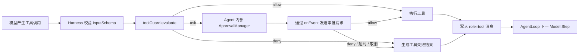
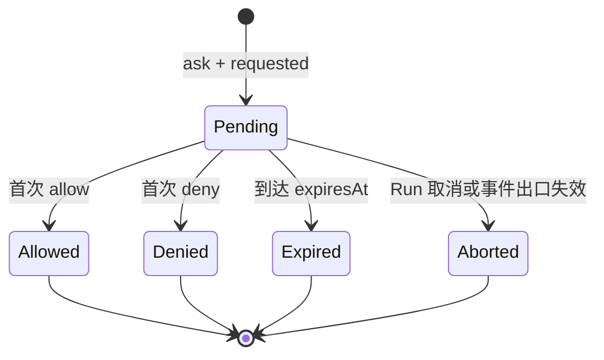
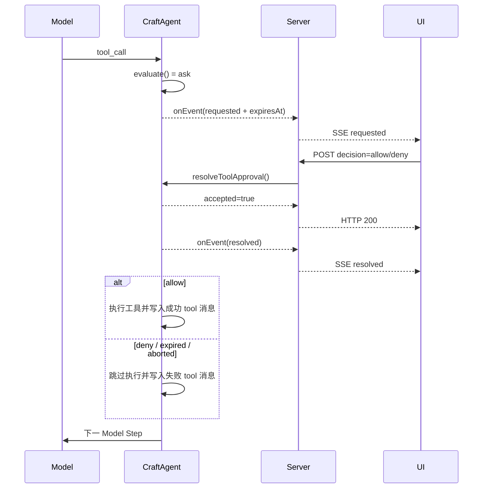

# 工具审批全链路：从风险评估到继续 AgentLoop

> 文档类型：学习文档；当前实现以 [Agent 门面协议](../standards/protocols/agent.md) 和
> [工具协议](../standards/protocols/tool.md) 为准。

## 1. 先建立正确的心智模型

CraftAgent 把“工具是否可以执行”拆成两个问题：

1. `toolGuard.evaluate()` 根据工具和本次参数返回 `allow`、`deny` 或 `ask`。
2. 只有返回 `ask` 时，Agent 内部才创建一次性审批并等待用户决定。

应用开发者只实现风险评估方法和传输层接线。审批 ID、等待中的 Promise、超时、取消、重复提交和
一次性决定都由 `Agent` 实例管理，不需要再创建 Broker。

最重要的语义是：`deny` 不会终止整个 AgentLoop。它只阻止当前工具实现执行，产生一条失败的
`role=tool` 消息，然后让模型在下一 Step 解释拒绝或改用其他方案。用户在审批卡片中选择“拒绝”也相同。



## 2. 四层职责

| 层级           | 做什么                                                                  | 不做什么                                   |
| -------------- | ----------------------------------------------------------------------- | ------------------------------------------ |
| 应用风险评估器 | 根据工具信息、已校验参数和业务上下文决定 `allow/deny/ask`               | 不等待前端，不执行工具                     |
| CraftAgent     | 校验评估结果；管理 pending 审批、ID、超时、取消和首个终态；恢复 Harness | 不依赖 HTTP、Fastify 或 Vue                |
| Server Runtime | 把 Agent 事件写入 SSE；把审批 POST 转给 `agent.resolveToolApproval()`   | 不保存 pending Promise，不决定风险         |
| 前端           | 展示卡片和倒计时；提交一次 `allow/deny`；按终态更新 UI                  | 不直接执行工具，不把按钮状态当成服务端事实 |

底层 `ToolPolicy` 和 `ToolApprovalHandler` 仍是 Tool Harness/AgentLoop 的高级协议。普通 Agent 使用者不需要
组装它们；`Agent` 会把 `toolGuard` 自动适配到底层协议。

## 3. 定义风险评估规则

### 3.1 最小配置

```ts
import Agent from 'craft-agent'

const agent = new Agent({
  model,
  tools: { additional: [manageResourceTool] },
  toolGuard: {
    approvalTimeoutMs: 120_000,
    evaluate(request) {
      if (request.tool.security.risk === 'safe')
        return { decision: 'allow' }

      return {
        decision: 'ask',
        reason: `工具 ${request.tool.name} 需要用户确认`,
      }
    },
  },
})
```

如果不配置 `toolGuard`，默认评估器只允许 `risk: 'safe'` 且没有 capability 的工具，其余调用自动
`deny`。这是最小权限默认值，不是沙箱。

### 3.2 evaluate 的输入

```ts
interface ToolGuardRequest {
  runId: string
  sessionId: string
  callId: string
  tool: {
    name: string
    description: string
    inputSchema: JsonSchema
    security: ToolSecurityMetadata
  }
  input: unknown
  signal: AbortSignal
}
```

- `input` 已通过工具的 `inputSchema` 校验，可以用于参数级风险判断。
- `tool.security` 是工具作者声明的最大风险和能力需求，不代表已经授权。
- `callId` 标识模型的当前工具调用；同一个 Session 可以有很多 callId。
- `runId/sessionId` 可用于读取宿主自己的租户、角色或业务策略，但 CraftAgent 不定义用户权限模型。
- 异步评估若访问外部服务，必须把 `signal` 继续传给下游请求。

### 3.3 evaluate 的输出

```ts
type ToolGuardDecision
  = | { decision: 'allow', metadata?: JsonObject }
    | { decision: 'deny', reason: string, metadata?: JsonObject }
    | {
      decision: 'ask'
      reason: string
      title?: string
      details?: JsonObject
      approvalTimeoutMs?: number
      metadata?: JsonObject
    }
```

- `allow`：当前调用直接进入工具执行阶段。
- `deny`：当前调用不执行；拒绝原因作为工具失败交回 AgentLoop。
- `ask`：Agent 创建一次性审批并暂停当前工具 Promise。
- `title/details`：必须是可安全发送给 UI 的已脱敏信息。
- `metadata`：用于轨迹上下文，不改变控制流。

评估器返回普通 TypeScript 对象即可。CraftAgent 会在运行时检查决定值、必填原因、JSON 数据和超时，
无效返回不会降级为允许。

### 3.4 参数级评估示例

一个工具可以声明最大风险为 `destructive`，再根据本次参数细分：

```ts
const toolGuard = {
  approvalTimeoutMs: 120_000,
  evaluate(request) {
    if (request.tool.name !== 'manage_resource') {
      return {
        decision: 'deny',
        reason: `未配置工具 ${request.tool.name} 的规则`,
      }
    }

    const input = request.input as {
      operation: 'read' | 'write' | 'delete'
      resource: string
    }

    if (input.operation === 'read')
      return { decision: 'allow' }

    if (input.operation === 'delete' && input.resource.startsWith('protected/')) {
      return {
        decision: 'deny',
        reason: '受保护资源不能删除',
      }
    }

    return {
      decision: 'ask',
      title: input.operation === 'write' ? '确认写入' : '确认删除',
      reason: `即将${input.operation}资源 ${input.resource}`,
      details: { operation: input.operation, resource: input.resource },
      approvalTimeoutMs: 45_000,
    }
  },
} satisfies ToolGuardConfig
```

最终超时优先级为：

```text
本次 ask.approvalTimeoutMs
  > toolGuard.approvalTimeoutMs
  > CraftAgent 默认值 120000ms
```

因此上例的读操作直接执行，受保护删除直接失败，普通写入/删除等待 45 秒，而不是通用的 120 秒。

## 4. Agent 内部发生了什么

`Agent` 构造时完成两项内部组装：

```text
toolGuard.evaluate
  -> 内部 ToolPolicy 适配器

Agent 内部 ApprovalManager.requestApproval
  -> AgentLoop / Tool Harness
```

当评估结果为 `ask` 时，ApprovalManager：

1. 生成唯一 `approvalId`。
2. 先登记 pending，再发送 requested 事件，避免极快提交先于登记到达。
3. 计算 `requestedAt`、`expiresAt` 并启动定时器。
4. 等待首个 `allow`、`deny`、超时或 Run 取消。
5. 删除 pending、发送 resolved 事件，并恢复等待中的 Harness Promise。



每个 `approvalId` 只能从 Pending 进入一个终态。后到的重复请求、未知 ID、已超时 ID都返回：

```ts
const duplicateResult = {
  accepted: false,
  reason: 'not-found-or-settled',
}
```

这一规则保证双击、网络重试或两个页面同时提交都不会使工具执行两次。

## 5. Agent 输出事件

### 5.1 请求用户审批

```json
{
  "type": "tool.approval.requested",
  "sessionId": "session-1",
  "runId": "run-1",
  "approvalId": "approval-1",
  "callId": "call-1",
  "toolName": "manage_resource",
  "title": "确认写入",
  "reason": "即将写入资源 demo/a",
  "details": { "operation": "write", "resource": "demo/a" },
  "input": { "operation": "write", "resource": "demo/a" },
  "risk": "destructive",
  "approvalTimeoutMs": 45000,
  "requestedAt": "2026-09-10T02:00:00.000Z",
  "expiresAt": "2026-09-10T02:00:45.000Z"
}
```

前端应以 `expiresAt` 为准显示倒计时。`approvalTimeoutMs` 方便诊断，但客户端本地计时误差不应改变
服务端终态。

### 5.2 审批终态

```json
{
  "type": "tool.approval.resolved",
  "sessionId": "session-1",
  "runId": "run-1",
  "approvalId": "approval-1",
  "callId": "call-1",
  "toolName": "manage_resource",
  "outcome": "allowed",
  "resolvedAt": "2026-09-10T02:00:06.000Z"
}
```

公开终态有：

| outcome   | 含义                     | 是否执行工具      |
| --------- | ------------------------ | ----------------- |
| `allowed` | 用户允许当前审批         | 是，仅当前 callId |
| `denied`  | 用户拒绝                 | 否                |
| `expired` | 服务端审批定时器到期     | 否                |
| `aborted` | Run 取消或审批出口不可用 | 否                |

### 5.3 自动拒绝

评估器直接返回 `deny` 时没有审批卡片和 `approvalId`，Agent 发送：

```json
{
  "type": "tool.guard.denied",
  "sessionId": "session-1",
  "runId": "run-1",
  "callId": "call-1",
  "toolName": "manage_resource",
  "reason": "受保护资源不能删除"
}
```

前端可以显示只读拒绝提示。这个事件不是整个 Run 的 `error`；模型仍会收到工具失败并继续。

## 6. 前后端交互

CraftAgent 不规定 HTTP URL。当前 Fastify Runtime 使用两个方向的通道：

- Agent → 前端：聊天 SSE 中发送 `tool.approval.requested/resolved` 和 `tool.guard.denied`。
- 前端 → Agent：HTTP POST 把用户决定提交给 Server，Server 调用 `agent.resolveToolApproval()`。



Server 伪代码：

```ts
fastify.post('/api/chat', async (request, reply) => {
  await agent.run({ input: request.body.message }, {
    onEvent: event => writeSse(reply, event),
  })
})

fastify.post('/api/tool-approvals/:approvalId', async (request, reply) => {
  const result = agent.resolveToolApproval({
    approvalId: request.params.approvalId,
    decision: request.body.decision, // 'allow' | 'deny'
  })

  if (!result.accepted)
    return reply.code(404).send(result)
  return result
})
```

前端伪代码：

```ts
function onAgentEvent(event: AgentOutputEvent) {
  if (event.type === 'tool.approval.requested') {
    approvalCard.value = {
      ...event,
      status: 'pending',
      remainingMs: Math.max(0, Date.parse(event.expiresAt) - Date.now()),
    }
  }

  if (event.type === 'tool.approval.resolved') {
    approvalCard.value.status = event.outcome
    stopCountdown()
  }
}

async function decide(decision: 'allow' | 'deny') {
  disableButtons()
  const response = await fetch(`/api/tool-approvals/${approvalId}`, {
    method: 'POST',
    headers: { 'Content-Type': 'application/json' },
    body: JSON.stringify({ decision }),
  })

  // HTTP 只表示提交是否被 Agent 接受；最终展示以 SSE resolved 为准。
  if (response.status === 404)
    showAlreadySettled()
}
```

## 7. deny 为什么仍然继续循环

模型消息协议要求每个 assistant tool call 都有对应的 `role=tool` 响应。如果策略拒绝后直接终止 Run，历史中会
留下悬空工具调用，而且模型没有机会告诉用户发生了什么。

因此固定数据流是：

```text
deny / 用户拒绝 / 审批超时
  -> Harness: TOOL_PERMISSION_DENIED, attempts=0
  -> AgentLoop: append role=tool failure
  -> 下一 Model Step
  -> 模型解释拒绝、询问新方案或完成回答
```

例如用户拒绝时模型看到的工具消息类似：

```json
{
  "role": "tool",
  "tool_call_id": "call-1",
  "content": "Error: 工具审批结果：rejected"
}
```

只有 Run 自己被取消、达到预算、模型失败或 Session 写入失败等 Run 级条件才会真正结束 AgentLoop。

## 8. 超时、断连与进程重启

- 超时由 Agent 的服务端定时器裁决；前端倒计时只是展示。
- 浏览器断开聊天 SSE 时，Server 应取消同一个 Run 的 `AbortSignal`。
- Run 清理会把仍 pending 的审批收口为 `aborted`，避免遗留 Promise。
- pending 审批目前只存在于 Agent 实例内；进程重启后不会恢复，旧 approvalId 必须视为失效。
- 若未来需要跨进程审批恢复，需要单独设计持久化状态机和认领协议，不能只把 Map 换成数据库表。

## 9. 安全边界

`ToolGuard` 是执行前决策点，不是 Node.js 沙箱。工具代码与 Agent 同进程运行时，恶意工具可以谎报 risk，
也可以绕过声明直接调用文件、网络或进程 API。当前项目假定工具由应用开发者静态注册且经过审查。

实践中还应注意：

- `input/title/details/reason` 可能进入浏览器和轨迹，必须脱敏。
- 租户、角色、资源所有权由使用者自己的服务和 Store 决定，CraftAgent 不内置业务权限体系。
- 审批允许的是一个 `callId`，不能缓存成永久权限。
- 对外部副作用工具，即使用户允许，也应在业务系统继续校验资源权限和幂等键。

## 10. 推荐源码阅读顺序

1. `src/craft-agent/agent/tool-guard.ts`：公共输入、输出和配置归一化。
2. `src/craft-agent/agent/tool-approval-manager.ts`：pending、超时、取消和首个终态。
3. `src/craft-agent/agent/agent.ts`：Agent 如何组装 Guard、Manager 和 AgentLoop。
4. `src/craft-agent/tools/execute-tool.ts`：底层 Harness 如何在执行前处理 allow/deny/ask。
5. `src/craft-agent/core/agent-loop.ts`：工具失败如何写成消息并继续下一 Step。
6. `src/server/agent-tools.ts`：参数级评估示例。
7. `src/server/app.ts`：SSE 与审批 POST 的薄适配。
8. `src/pages/index.vue`：卡片、倒计时和终态 UI。

对应测试：

- `test/tool-approval-manager.test.ts`：一次性决定、重复提交和取消。
- `test/agent-facade.test.ts`：Agent 公开 API、单次超时覆盖和恢复执行。
- `test/server-runtime.test.ts`：真实 HTTP/SSE 的允许、用户拒绝和自动拒绝。
- `test/chat-page.test.ts`：前端卡片、倒计时和提交协议。

## 11. 动手练习

1. 为 `read/write/delete` 分别返回 `allow/ask/deny`，观察工具实现是否执行。
2. 把通用超时设为 60 秒、某次 ask 设为 5 秒，确认事件中的 `expiresAt` 使用 5 秒。
3. 连续两次提交同一 approvalId，确认只有第一次 `accepted=true`。
4. 用户拒绝后检查下一次模型请求，确认包含对应的失败 `role=tool` 消息。
5. 在 pending 时断开 SSE，确认工具不执行且审批终态为 `aborted`。
