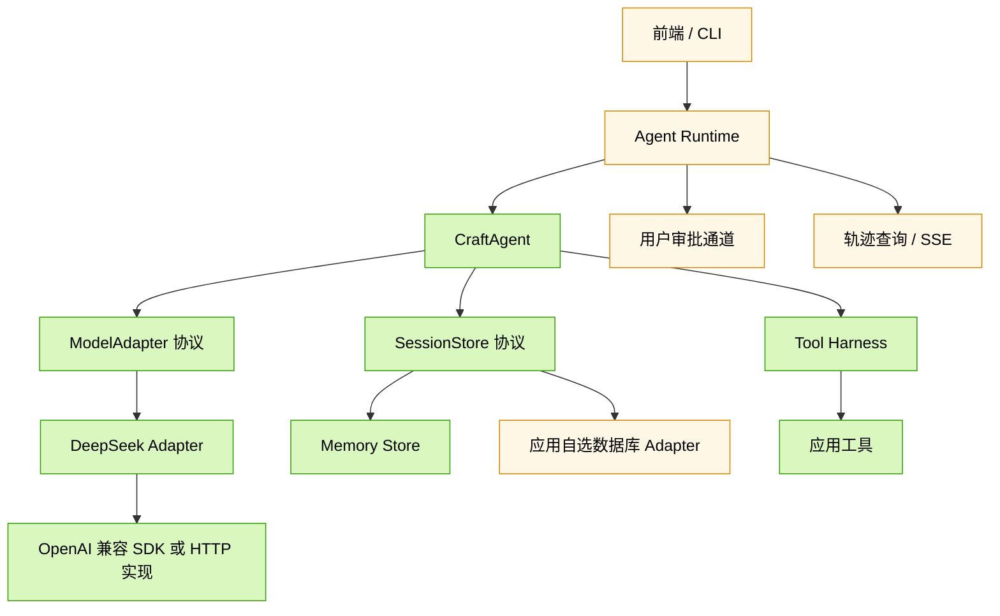
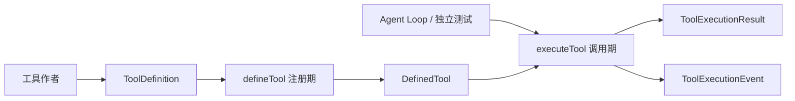
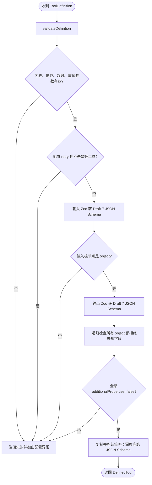
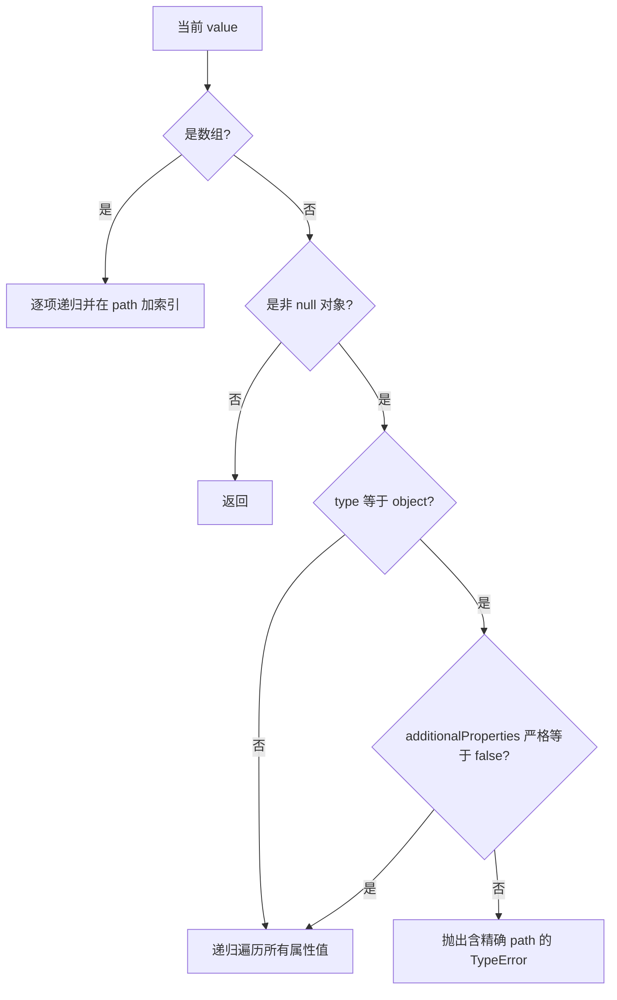
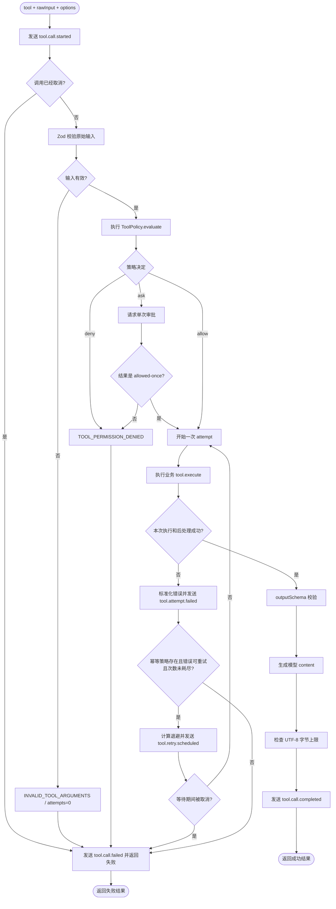
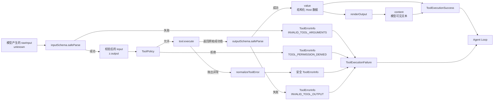
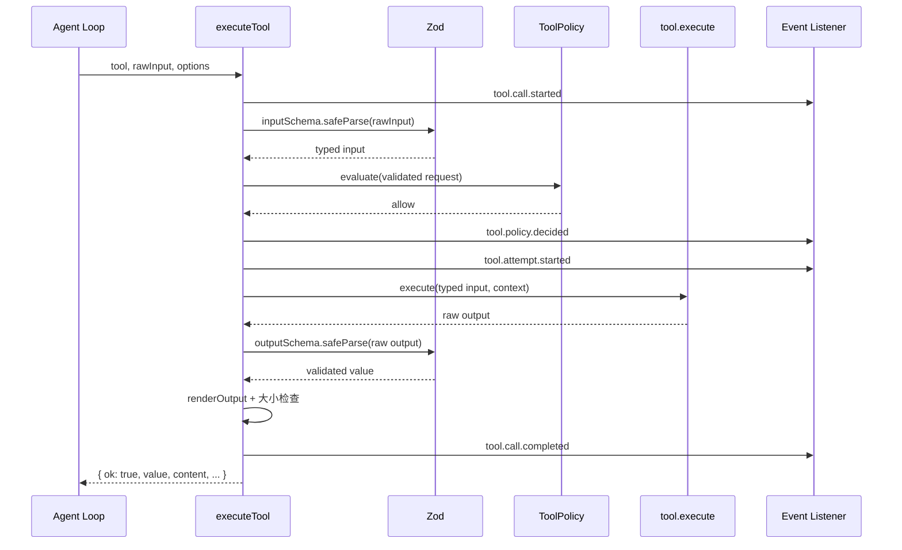
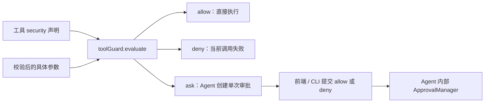
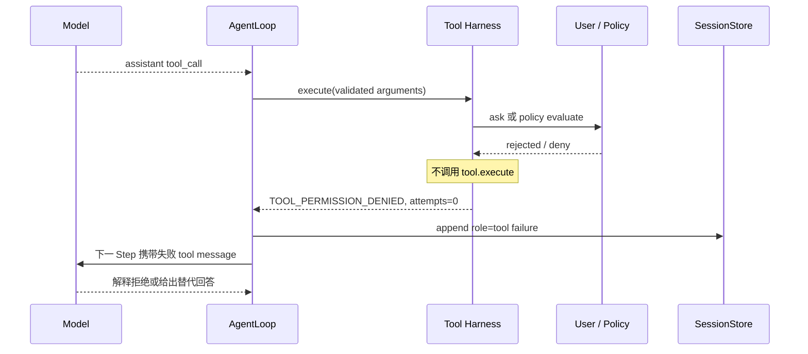
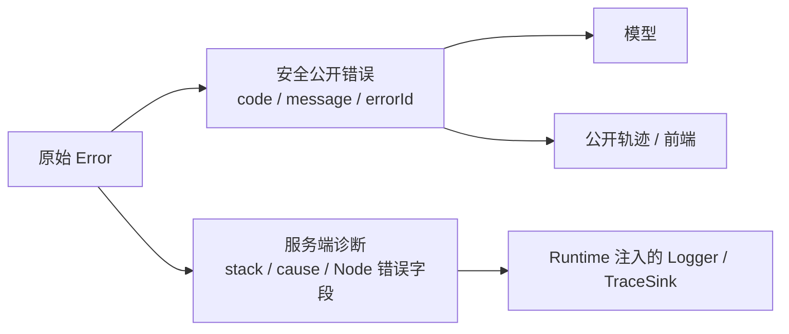

# 第一阶段学习指南：从定义工具到执行结果

> 文档类型：学习指南；适用版本：阶段 1 及以后。

本文为教学目的解释执行流程；稳定字段、错误码和安全规则以[工具协议](../standards/protocols/tool.md)为准。

## 1. 这份指南要解决什么

本指南聚焦 **Tool Harness（工具执行内核）**。当前 Agent Loop 已经使用该模块，但工具注册与单次调用边界仍可独立学习。

学完本指南，你应该能够回答以下问题：

1. 一个工具在什么时候完成注册，什么时候真正执行？
2. Zod Schema 为什么既服务 TypeScript，又服务模型和运行时？
3. 原始模型参数经过哪些边界后才会进入业务函数？
4. 权限、审批、超时、重试、输出校验分别由谁负责？
5. `value`、`content`、公开错误和轨迹事件有什么区别？
6. 当前代码已经实现了什么，哪些仍然只是开发计划？

建议阅读时同时打开：

- [`src/craft-agent/tools/types.ts`](../../src/craft-agent/tools/types.ts)：先看公共数据结构。
- [`src/craft-agent/tools/define-tool.ts`](../../src/craft-agent/tools/define-tool.ts)：理解注册期。
- [`src/craft-agent/tools/execute-tool.ts`](../../src/craft-agent/tools/execute-tool.ts)：理解调用期。
- [`test/craft-agent-tools.test.ts`](../../test/craft-agent-tools.test.ts)：用可运行的例子验证理解。

## 2. 先建立整体认识

### 2.1 CraftAgent 最终所处的位置

下面是整体目标；Agent Core、模型、Session 和内存 Store 已实现，Runtime 轨迹接口和数据库 Store 仍在规划中：



图中绿色部分已经实现；黄色部分仍由后续 Runtime 和 Store 阶段完成。

### 2.2 本阶段只有两条主线



- **注册期**：应用启动或组装 Runtime 时调用 `defineTool()`，提前发现工具定义错误。
- **调用期**：模型产生工具调用后，由 Agent Loop 通过 `createAgentTool()` 包装入口调用 `executeTool()`。

不要把两者混为一谈。`defineTool()` 不执行业务；`executeTool()` 也不会重新设计工具协议。

## 3. 目录与模块职责

```text
src/craft-agent/
  index.ts                       # CraftAgent 第一阶段统一导出入口
  types/
    json.ts                      # 与供应商无关的 JSON 基础类型
  tools/
    types.ts                     # 工具定义、执行上下文、重试与安全元数据
    define-tool.ts               # 注册期校验、Schema 转换和协议冻结
    policy.ts                    # allow / deny / ask 权限决策
    errors.ts                    # 标准工具错误与公开错误归一化
    events.ts                    # 实时工具轨迹事件联合类型
    execute-tool.ts              # 完整调用管线：校验、授权、执行、重试、输出
    index.ts                     # tools 子模块统一导出
  builtins/
    current-time.ts              # 可注入时钟的安全时间工具
    calculator.ts                # 不使用 eval 的结构化计算器
    index.ts                     # 内置工具统一导出
```

| 模块              | 输入                     | 输出                         | 不负责什么                  |
| ----------------- | ------------------------ | ---------------------------- | --------------------------- |
| `types/json.ts`   | 无                       | JSON 与 JSON Schema 基础类型 | 不执行 JSON Schema 校验     |
| `tools/types.ts`  | Zod 类型                 | 工具相关 TypeScript 协议     | 不包含执行流程              |
| `define-tool.ts`  | `ToolDefinition`         | `DefinedTool`                | 不执行业务函数              |
| `policy.ts`       | 已校验参数和安全声明     | `allow`、`deny` 或 `ask`     | 不替代业务内部的资源级鉴权  |
| `errors.ts`       | 任意异常或 Zod issue     | 安全、可序列化的公开错误     | 当前不保存完整服务端堆栈    |
| `events.ts`       | 执行过程状态             | 有判别字段的轨迹事件         | 当前不负责持久化和脱敏      |
| `execute-tool.ts` | 工具、原始参数、运行选项 | 规范成功或失败结果           | 不负责选择工具和 Agent 循环 |
| `builtins/*`      | 创建参数                 | 可显式注册的 `DefinedTool`   | 不会被框架自动启用          |

## 4. 必须先掌握的数据结构

### 4.1 `ToolDefinition`：工具作者填写的定义

```ts
const echoTool = defineTool({
  name: 'echo',
  description: '返回输入文本。',
  inputSchema: z.strictObject({ text: z.string() }),
  outputSchema: z.strictObject({ text: z.string() }),
  timeoutMs: 1_000,
  security: {
    risk: 'safe',
    capabilities: [],
    idempotent: true,
  },
  execute(input, context) {
    return { text: input.text }
  },
})
```

字段可以分成四组：

| 分组            | 字段                                                     | 消费者                      |
| --------------- | -------------------------------------------------------- | --------------------------- |
| 模型理解工具    | `name`、`description`、`inputSchema` 的 JSON Schema 投影 | `ModelAdapter`              |
| Host 运行时校验 | `inputSchema`、`outputSchema`                            | `defineTool`、`executeTool` |
| 执行控制        | `timeoutMs`、`retry`、`security`                         | Tool Harness、Runtime 策略  |
| 业务逻辑        | `execute`、可选 `renderOutput`                           | Tool Harness                |

`outputSchema` 不需要发送给模型，但它可以阻止错误的上游返回值进入模型和会话。

### 4.2 `DefinedTool`：注册后的工具

`defineTool()` 返回的对象在原定义上增加两份缓存投影：

```ts
interface DefinedTool {
  // 原 ToolDefinition 字段……
  model: {
    name: string
    description: string
    inputSchema: JsonSchema
  }
  outputJsonSchema: JsonSchema
}
```

- `model` 是未来 ModelAdapter 能看到的最小工具定义，不包含 `execute`、重试和权限策略。
- `outputJsonSchema` 为文档、轨迹和未来组合工具保留，不在第一阶段发送给模型。
- 生成后的 JSON Schema 会被深度冻结。
- `retry` 和 `security` 会复制后冻结，避免调用方修改已注册执行策略。
- `inputSchema`、`outputSchema` 本身仍是原 Zod Schema 引用；`assertClosedObjects()` 也不是变更检测器。

### 4.3 `ToolRunContext`：单次尝试的上下文

```ts
interface ToolRunContext {
  callId: string
  runId?: string
  sessionId?: string
  attempt: number
  signal: AbortSignal
}
```

- 一个逻辑 Tool Call 在重试期间保持相同 `callId`。
- `attempt` 从 1 开始递增。
- `signal` 用于取消和协作式超时，工具应继续传给 `fetch` 等下游 API。

### 4.4 `ToolExecutionResult`：调用方得到的封闭结果

成功：

```ts
const successResult = {
  ok: true,
  value: { text: 'hello' },
  content: '{"text":"hello"}',
  attempts: 1,
  durationMs: 3,
}
```

失败：

```ts
const failureResult = {
  ok: false,
  error: {
    code: 'INVALID_TOOL_ARGUMENTS',
    message: '工具 echo 的参数未通过校验',
    retryable: false,
    details: { issues: [/* 安全的校验问题 */] },
  },
  content: 'Error: 工具 echo 的参数未通过校验',
  attempts: 0,
  durationMs: 1,
}
```

`value` 是 Host 使用的结构化成功值；`content` 是未来写回模型的文本。失败没有伪造一个满足
`outputSchema` 的值，而是使用独立的失败类型。

## 5. 注册期：`defineTool()` 做了什么

### 5.1 注册流程图



### 5.2 为什么注册时就失败

这些问题属于开发者配置错误，不应该等到模型实际调用时才暴露：

- 工具名不符合协议。
- 描述为空，模型无法判断使用时机。
- 使用无法转换为 JSON Schema 的 Zod 类型。
- 输入根节点不是对象。
- 嵌套对象允许未知字段。
- 非幂等工具配置了自动重试。
- 超时和退避参数无效。

这叫 **fail fast（尽早失败）**。

### 5.3 `assertClosedObjects()` 的准确职责

它的输入不是用户调用工具时传入的业务数据，而是转换后的 JSON Schema 节点：

```ts
assertClosedObjects(
  inputJsonSchema,
  'inputSchema',
  definition.name,
)
```

递归规则如下：



它只执行一条协议约束：所有对象节点必须是封闭对象。它不负责：

- 检查真实工具参数；真实参数由 `inputSchema.safeParse()` 检查。
- 检测配置在中途是否被修改。
- 禁止 `oneOf`、数组或合法嵌套；它会进入这些结构继续检查对象节点。
- 验证任意 JSON Schema 是否完全正确；Zod 的转换器负责生成 Schema。

例如 `oneOf[1]` 中存在宽松对象时，路径会类似：

```text
inputSchema.oneOf[1]
```

## 6. 调用期：`executeTool()` 的完整流程

### 6.1 主流程图



图中“本次执行和后处理成功”还包含超时识别、输出校验、内容投影和大小检查。任一步失败都会变成规范错误。

### 6.2 数据流转图



最重要的边界是：

```text
unknown 原始输入 -> 校验后的类型化输入 -> 未校验的业务返回 -> 校验后的成功值
```

任何来自模型、网络、数据库或工具实现的数据，都不能因为 TypeScript 写了类型就被当成可信数据。

### 6.3 一次成功调用的时序



### 6.4 一次重试调用的事件顺序

假设前两次抛出 `retryable: true` 的 `ToolError`，第三次成功：

```text
tool.call.started
tool.policy.decided
tool.attempt.started        attempt=1
tool.attempt.failed         attempt=1
tool.retry.scheduled        attempt=1
tool.attempt.started        attempt=2
tool.attempt.failed         attempt=2
tool.retry.scheduled        attempt=2
tool.attempt.started        attempt=3
tool.call.completed         attempts=3
```

审批在 attempt 循环之前，所以自动重试不会反复请求用户授权。

## 7. 权限、安全与审批

### 7.1 工具只能声明风险，不能给自己授权

```ts
const security = {
  risk: 'read',
  capabilities: ['network:public'],
  idempotent: true,
}
```

这段代码表达“工具需要什么”，不表达“工具已经被允许”。普通应用把决定权交给 Agent 配置中的
`toolGuard.evaluate()`；Agent 再在内部适配成 Harness 使用的 `ToolPolicy`。



Agent 默认 ToolGuard 与底层 `safeToolPolicy` 都只允许：

```text
risk === 'safe' 且 capabilities 为空
```

缺少策略、缺少审批通道、审批通道异常或返回无效结果时，都不能静默变成授权。这是
**fail closed（失败时保持拒绝）**。

这里存在一个必须掌握的可信前提：当前策略相信第一方工具作者填写的元数据。它能防止误配置，
不能识别一个谎报 `risk: 'safe'` 的恶意同进程函数。Schema 验证的是字段形状，不是声明真实性；
详细说明见[安全与信任模型](../standards/security/trust-model.md)。

### 7.2 权限层不能替代业务鉴权

CraftAgent 可以判断某工具是否允许访问网络，但“当前用户是否能读取订单 123”仍应由业务服务判断。

```text
CraftAgent 能力级授权：允许调用 order_read 工具
业务服务资源级授权：用户 A 是否能读取 orderId=123
```

### 7.3 拒绝以后，Agent 为什么还能继续回答

`deny` 或用户点击“拒绝”只是否定这一次工具调用，不等于让整个 Agent Run 抛异常。Harness 会生成
`attempts: 0` 的失败结果，AgentLoop 再把它作为对应 `tool_call_id` 的 `role: 'tool'` 消息写入 Session：



因此交互层不应在用户拒绝时主动关闭聊天 SSE，也不应自行伪造助手回复。它只需要把审批结果交还
`agent.resolveToolApproval()`，然后继续等待 AgentLoop 的模型增量和最终结果。只有 Run 取消信号才负责终止整轮。
Agent 内部 Manager、HTTP/SSE 和 Vue 确认卡片的逐节点说明见
[工具审批全链路教程](./tool-approval-flow.md)。

## 8. 重试、超时与取消

### 8.1 重试必须同时满足的条件

| 条件                           | 由谁提供         | 不满足时       |
| ------------------------------ | ---------------- | -------------- |
| 定义了 `retry`                 | 工具定义         | 不重试         |
| `security.idempotent === true` | 工具作者         | 注册直接失败   |
| 本次错误 `retryable === true`  | 错误或超时归一化 | 不重试         |
| 未达到 `maxAttempts`           | Harness          | 返回最终失败   |
| 调用未取消                     | Runtime / 用户   | 返回 `ABORTED` |

`maxAttempts` 包含第一次执行。例如 `maxAttempts: 3` 表示最多执行三次，不是“首次加三次重试”。

注册期只能确认开发者同时配置了 `retry` 和 `idempotent: true`，无法观察任意网络、数据库或进程
副作用来证明工具真的幂等。真实幂等性需要 `callId` 去重键、上游幂等协议、存储唯一约束和集成测试。

未知 JavaScript 异常默认不可重试。工具作者必须明确将临时故障包装为：

```ts
throw new ToolError({
  code: 'UPSTREAM_TIMEOUT',
  message: '上游请求超时',
  retryable: true,
  cause: error,
})
```

### 8.2 超时是协作式的

Harness 会中止 `context.signal`：

```ts
const response = await fetch(url, { signal: context.signal })
```

如果工具忽略信号，Node.js 无法安全强杀同进程中的普通函数。当前实现会等待工具最终返回或抛错后，
再识别已经发生的超时；如果工具永远不结束，调用也不会自行返回。长时间 CPU 工作未来应放进
Worker 或子进程。

## 9. 错误的两种角色

### 9.1 当前已经实现：公开、安全错误

`ToolErrorInfo` 的目标是稳定、可序列化，并能够进入模型响应、公开轨迹和未来会话事件：

```ts
interface ToolErrorInfo {
  code: string
  message: string
  retryable: boolean
  details?: JsonObject
}
```

`normalizeToolError()` 的规则：

- `ToolError`：保留业务 `code`、`message`、`retryable` 和安全 `details`。
- 普通 `Error`：映射为 `TOOL_EXECUTION_FAILED`，默认不可重试。
- 其他未知抛出值：尽力转成安全字符串。

### 9.2 当前尚未实现：服务端异常诊断

公开错误故意不包含完整 `stack` 和原始 `cause`，但如果执行边界只留下公开错误，服务端会失去关键诊断信息。
后续将增加独立、可注入的诊断出口，并用 `errorId` 关联两侧：



这项能力只进入后续开发计划，本阶段没有实现。详细验收要求见
[分阶段开发路线图](../product/roadmap.md)。

## 10. 轨迹事件怎么理解

轨迹不是执行结果的另一种写法，而是“执行过程中发生了什么”的时间序列。

所有事件都有以下关联字段：

```ts
interface ToolEventBase {
  callId: string
  runId?: string
  sessionId?: string
  toolName: string
  timestamp: string
}
```

通过 `type` 判断具体事件后，TypeScript 会收窄其字段：

```ts
function printEvent(event: ToolExecutionEvent) {
  if (event.type === 'tool.attempt.failed') {
    console.log(event.attempt, event.error.code)
  }
}
```

事件监听器属于观察边界。即使前端 SSE 或轨迹后端暂时故障，也不能把已经成功的业务操作改写成失败。
当前监听器异常会被隔离；未来诊断出口应记录这类异常，而不能继续静默丢失。

需要特别注意：`tool.call.started` 当前携带原始输入。未来把事件暴露给前端或持久化前，必须实施字段脱敏和大小限制。

## 11. 两个内置工具为什么这样设计

### 11.1 `get_current_time`

- 不访问网络或数据库，属于 `safe`。
- 使用 IANA 时区，避免只返回模糊的本地时间。
- 通过 `Clock` 注入时间，使测试结果确定。
- 无效时区被转换成稳定的 `ToolError`。

测试不需要等待真实时间：

```ts
createCurrentTimeTool({
  clock: { now: () => new Date('2026-09-07T04:00:00Z') },
})
```

### 11.2 `calculator`

- 模型传递结构化的 `operation` 和 `values`。
- 不接收任意表达式，不使用 `eval()`，避免代码注入。
- 业务层检查不同运算的参数数量和除零错误。
- Zod 负责基础形状，业务函数负责跨字段语义。

这展示了两种不同校验：

```text
Schema 校验：values 是有限数字数组，长度 1 到 100
业务校验：divide 必须恰好两个值，第二个值不能是 0
```

## 12. 推荐的源码学习顺序

### 第一遍：只看公共协议

1. `types/json.ts`
2. `tools/types.ts`
3. `tools/policy.ts`
4. `tools/errors.ts`
5. `tools/events.ts`

目标：不看实现也能口头描述输入、输出和边界。

### 第二遍：看注册期

1. 从 `defineTool()` 入口向下跟。
2. 观察 `validateDefinition()` 验证哪些开发者配置。
3. 观察 `toJsonSchema()` 如何产生模型协议。
4. 用宽松嵌套对象触发 `assertClosedObjects()`。
5. 比较 `ToolDefinition` 和返回的 `DefinedTool`。

### 第三遍：看调用期

1. 从 `executeTool()` 开始，只跟正常成功路径。
2. 再跟输入失败和权限拒绝路径。
3. 最后跟 `executeAttempt()`、重试、超时和取消。
4. 对照每个分支会发送哪些事件。

### 第四遍：从测试反推设计

运行：

```bash
pnpm test -- --run test/craft-agent-tools.test.ts
```

然后给单个测试加断点，依次观察：

```text
rawInput
inputResult.data
policyDecision
context.attempt
rawOutput
outputResult.data
content
ToolExecutionResult
```

## 13. 用练习确认自己真正掌握

这些练习不要求现在扩展框架，只用于本地实验。完成后可以撤销实验代码。

1. **输入边界**：给 `echo` 传入一个未声明字段，确认 `execute` 没有被调用。
2. **输出边界**：让 TypeScript 看起来返回正确类型，但运行时返回错误字段，确认得到 `INVALID_TOOL_OUTPUT`。
3. **权限边界**：定义带 `network:public` 的工具，分别测试没有策略、`deny`、`ask` 和 `allow`。
4. **重试边界**：前两次抛出可重试 `ToolError`，第三次成功，打印完整事件序列。
5. **取消边界**：在重试等待期间触发 `AbortController.abort()`，确认不会开始下一次 attempt。
6. **Schema 递归**：分别在普通嵌套、数组元素和联合分支中使用宽松 `z.object()`，观察错误路径。
7. **观察器隔离**：让 `onEvent` 抛错，确认业务成功结果没有变化。

能够解释每个结果“为什么发生”，比记住函数代码更重要。

## 14. 常见误解

### “TypeScript 已经有类型，为什么还需要 Zod？”

TypeScript 类型在编译后消失，模型传入的是运行时 `unknown`。Zod 才是运行时边界。

### “`outputSchema` 不发给模型，所以可以不要？”

不能。它保护的是工具实现、网络和数据库返回值进入 Agent 前的边界。

### “设置 `retryable: true` 就一定会重试？”

不能。还必须配置重试策略、声明幂等、未达到次数上限并且调用没有取消。

### “`security` 写成 safe 就获得权限了？”

没有。它只是声明，最终决定来自 Runtime 的策略。

### “轨迹事件就是会话历史？”

不是。当前事件是实时观察协议。未来只有经过定义、脱敏和持久化的 `SessionEvent` 才构成可重建的会话事实。

### “`ToolErrorInfo` 就是完整日志？”

不是。它是安全公开错误。完整服务端堆栈和 `cause` 的诊断出口仍在规划中。

## 15. 当前完成边界

已经完成：

- Zod 驱动的工具定义和 JSON Schema 投影。
- 注册期协议检查。
- 输入输出运行时校验。
- 权限、审批、重试、协作式超时和取消。
- 规范成功/失败结果。
- 工具实时事件。
- 两个安全内置工具和核心单元测试。

尚未完成：

- 完整 Trace、服务端异常堆栈日志与脱敏管线。
- 轨迹查询 API、SSE 协议和前端调试视图。
- 文件、网络、数据库和 Shell 等高风险内置工具。

后续已经完成：

- CraftAgent 内部 `ModelAdapter` 协议、通用 OpenAI Compatible Adapter 与 DeepSeek 差异层；现有 Server
  不再直接依赖 OpenAI SDK。
- OpenAI Chat Completions 兼容的标准 chunk、非流式结果、用量和模型错误分类。
- 统一 `defineAgentConfig()`、Scripted 测试 Adapter 与契约探针。详见
  [阶段 2 交付记录](../product/deliveries/delivery-003-model-adapter.md)和
  [阶段 2.1 交付记录](../product/deliveries/delivery-004-official-adapter-toolkit.md)。
- append-only Session Log、乐观并发和模型消息推导。
- Agent Loop、流式工具调用组装、预算、取消、停止原因和实时事件。详见
  [Agent Loop 学习指南](./agent-loop.md)。

掌握这一边界后继续阅读 Agent Loop，可以看到工具怎样进入完整模型循环，同时仍保持独立协议。
