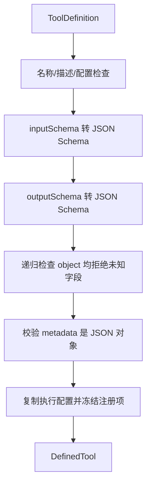
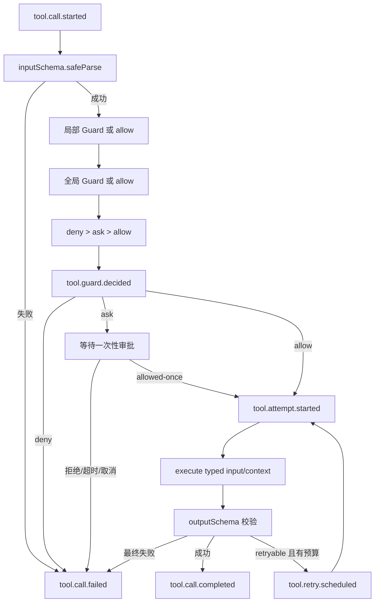

# Tool Harness：从工具定义到规范结果

> 文档类型：学习指南。建议配合 `src/craft-agent/tools` 与 `test/craft-agent-tools.test.ts` 阅读。

## 1. Tool Harness 是什么

Tool Harness 位于模型产生 Tool Call 和业务函数之间。它解决的不是“怎么写天气接口”，而是所有工具都必须
一致处理的边界：

```text
模型参数
  -> 输入校验
  -> 工具级 Guard
  -> 全局 Guard
  -> 可选用户审批
  -> 超时与重试
  -> 业务 execute
  -> 输出校验
  -> 模型文本投影
  -> 成功或失败结果
```

AgentLoop 因此不需要知道每个函数的参数类型、风险规则和错误格式。

## 2. 目录职责

```text
src/craft-agent/tools/
  types.ts         ToolDefinition、执行配置、ToolRunContext
  define-tool.ts   注册期校验、JSON Schema 编译、冻结
  guard.ts         Guard 输入、决定和审批端口
  execute-tool.ts  调用期状态机与两层 Guard 合并
  errors.ts        业务错误与安全错误归一化
  events.ts        Tool Harness 轨迹事件
  index.ts         tools 模块导出
```

普通使用者主要接触 `defineTool`、`ToolError` 和 Agent 配置；`executeTool` 适合底层测试或直接使用
Harness 的高级场景。

## 3. ToolDefinition

```ts
const echoTool = defineTool({
  name: 'echo',
  description: '返回输入文本。',
  inputSchema: z.strictObject({ text: z.string() }),
  outputSchema: z.strictObject({ text: z.string() }),
  metadata: { domain: 'demo', risk: 'safe' },
  guard: request => ({ decision: 'allow' }),
  execution: {
    timeoutMs: 1_000,
    retry: {
      maxAttempts: 2,
      baseDelayMs: 100,
      maxDelayMs: 500,
    },
  },
  execute(input, context) {
    return { text: input.text }
  },
})
```

字段可以分成四类：

| 类别       | 字段                           | 谁消费       |
| ---------- | ------------------------------ | ------------ |
| 模型协议   | name、description、inputSchema | ModelAdapter |
| 成功值协议 | outputSchema、renderOutput     | Harness      |
| 调用控制   | guard、execution               | Harness      |
| 业务实现   | metadata、execute              | Guard 与工具 |

`outputSchema` 虽然不发给模型，仍能发现实现错误和上游协议漂移。

## 4. defineTool 注册期



### assertClosedObjects 的准确职责

`assertClosedObjects(value, schemaName, toolName, path)` 接收的是 Zod 转换后的 JSON Schema 节点，不是
原始业务输入。它递归检查所有 `type: object` 节点是否包含
`additionalProperties: false`，以保证模型看到的 JSON Schema 与 Zod 运行时行为一致。

它能发现：

- 根对象或数组元素中的宽松对象；
- union/oneOf 分支里嵌套的宽松对象；
- Schema 转换结果中的任意深层 object。

它不负责：

- 判断 oneOf 是否应该用于业务设计；
- 检测注册后的任意外部篡改以外的业务语义；
- 证明 metadata 中的风险标签真实；
- 证明 execute 具有幂等性。

参数顺序遵循项目规范：主要检查对象 `value` 在前，Schema 语义其次，诊断用工具名与递归路径靠后。

## 5. ToolRunContext

```ts
interface ToolRunContext<TContext> {
  callId: string
  runId?: string
  sessionId?: string
  attempt: number
  context: TContext
  signal: AbortSignal
}
```

- `callId` 在同一逻辑调用的所有重试中保持不变，可作为幂等键。
- `attempt` 从 1 开始，每次自动重试递增。
- `context` 是当前 Agent Run 的租户、用户和环境等宿主数据。
- `signal` 合并调用方取消和单次工具超时。

context 只沿调用栈向下传递，不进入模型、Session 或默认事件。

## 6. 调用期状态机



业务 `execute()` 永远拿到已校验输入。Guard 也只在输入校验成功后运行，避免畸形模型参数进入路径、权限或
租户判断。

## 7. 两层 Guard

工具级 Guard 与工具一起定义：

```ts
function guard(request: { input: { operation: string } }) {
  if (request.input.operation === 'read')
    return { decision: 'allow' }
  return { decision: 'ask', reason: '该操作会改变数据' }
}
```

全局 Guard 在 Agent 上配置：

```ts
const agent = new Agent<AppContext>({
  model,
  tools: {
    guard(request) {
      return request.context.permissions.includes('tools:execute')
        ? { decision: 'allow' }
        : { decision: 'deny', reason: '当前用户没有工具权限' }
    },
  },
})
```

缺省 Guard 直接 allow。两层都存在时顺序执行，最终优先级为 `deny > ask > allow`。Guard 异常或非法返回
产生 `TOOL_GUARD_FAILED`，不会执行工具。

两层使用相同的请求和返回协议，Harness 会把同一个请求对象先后交给它们。工具级 Guard 的 input 保留 Zod
推导类型；全局 Guard 的 input 为 `unknown`，但二者读取的是同一份请求级 context。

完整审批与前后端交互见[工具审批全链路](./tool-approval-flow.md)。

## 8. 重试

配置 `execution.retry` 本身就是工具作者允许重复调用的明确决定：

```ts
const execution = {
  retry: {
    maxAttempts: 3, // 包含首次执行
    baseDelayMs: 250,
    maxDelayMs: 2_000,
    backoff: 'exponential',
    jitterRatio: 0.2,
  },
}
```

只有规范错误明确 `retryable: true` 才会进入下一 attempt。输入错误、Guard 拒绝、审批拒绝、输出错误和
主动取消不会重试。

CraftAgent 不验证幂等性。对于创建订单等副作用操作，工具作者必须使用同一 `callId` 建立上游或数据库
幂等约束。

## 9. 超时与取消

`execution.timeoutMs` 作用于每次 attempt。Harness 使用 AbortSignal 通知工具，但不能强杀忽略信号的
同步 JavaScript。网络工具应传递信号：

```ts
async function execute(input: { url: string }, context: { signal: AbortSignal }) {
  const response = await fetch(input.url, { signal: context.signal })
  return await response.json()
}
```

超时错误标记为 retryable；是否真的重试仍取决于 `execution.retry`。

## 10. 结果与错误

```ts
type ToolExecutionResult<T>
  = | {
    ok: true
    value: T
    content: string
    attempts: number
    durationMs: number
  }
  | {
    ok: false
    error: ToolErrorInfo
    content: string
    attempts: number
    durationMs: number
  }
```

`ToolError` 用于可预期业务异常；未知 Error 会归一化。公开错误不带 stack/cause，因为它会返回模型或进入
公开轨迹。后续 DiagnosticSink 会在服务端单独记录完整异常，两种用途不能混在一个对象里。

## 11. 轨迹事件

一次“前两次失败、第三次成功”的典型顺序：

```text
tool.call.started
tool.guard.decided
tool.attempt.started       attempt=1
tool.attempt.failed        attempt=1
tool.retry.scheduled
tool.attempt.started       attempt=2
tool.attempt.failed        attempt=2
tool.retry.scheduled
tool.attempt.started       attempt=3
tool.call.completed        attempts=3
```

轨迹不是 Session 历史。Session 只保存模型继续对话所需的事实；轨迹用于调试和观测。

## 12. 推荐阅读与练习

阅读顺序：

1. `tools/types.ts`：先认识输入输出和上下文。
2. `tools/guard.ts`：理解 Guard 的封闭决定。
3. `tools/define-tool.ts`：看注册期检查。
4. `tools/execute-tool.ts`：沿主流程看状态机。
5. `test/craft-agent-tools.test.ts`：用测试反推边界。

练习：

1. 定义一个包含嵌套宽松对象的 Schema，观察注册期错误路径。
2. 定义局部 ask、全局 deny，确认两个函数都执行而业务函数不执行。
3. 通过 `new Agent<AppContext>()` 将 tenantId 传到 Guard 和 execute。
4. 创建前两次抛 retryable ToolError、第三次成功的工具，观察事件。
5. 让工具忽略 AbortSignal，对比“通知超时”和“强制终止”的差别。
