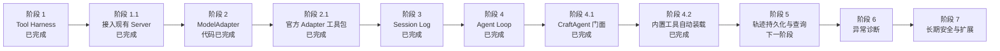

# CraftAgent 分阶段开发路线图

> 文档类型：产品路线图；状态：Active。

## 1. 当前优先级原则

- **先完成可运行的 Agent 主链，再扩展低收益的防御性体系。**
- 每个阶段先在当前单一项目中测试验证，不提前拆分 npm packages。
- CraftAgent 核心继续保持与模型 SDK、HTTP 框架、数据库驱动和前端解耦。
- 当前使用者是能够修改并运行服务端代码的第一方开发者，暂不支持不可信第三方工具注入。
- 工具默认不重试；开发者声明幂等并提供重试策略即可，暂不实现第三方幂等性审查。
- 安全信任、插件沙箱和第三方代码治理放在核心功能完成后的长期强化阶段。

## 2. 阶段总览

## 3. 阶段 1：工具协议与 Harness（已完成）

完成范围：

- `defineTool()` 将 Schema、实现和执行元数据放在一起。
- Zod 输入/输出校验及 Draft 7 JSON Schema 投影。
- allow/deny/ask 策略与单次审批。
- 幂等重试、随机退避、协作式超时和取消。
- `ToolError`、`ToolExecutionResult` 和工具轨迹事件。
- `get_current_time`、`calculator` 安全内置工具。

学习入口见[Tool Harness 学习指南](../learning/tool-harness.md)。

## 4. 阶段 1.1：接入现有 Server（已完成）

目标是先在真实 DeepSeek 对话中使用和验证 CraftAgent 工具协议。

当前完成：

- Server 的工具通过 `defineTools()` 注册，模型参数仍只来自 `DefinedTool.model`。
- 模型 Tool Call 由 CraftAgent AgentLoop 通过 `executeTool()` 执行。
- 时间、IP 定位和天气工具使用 `defineTool()` 统一 Schema 与实现。
- 移除旧的手写 `tools.json` 和旧 Tool Harness，避免双协议漂移。
- 支持通过静态注册表开发第一方自定义工具。
- 服务端工具测试覆盖 Schema 投影、输入校验、输出和网络重试。

阶段验证：

1. 使用真实 DeepSeek 测试时间、指定城市天气和自动定位天气。
2. 按[自定义工具开发实践](../learning/custom-tool-development.md)新增一个简单工具。
3. 验证错误输入、错误输出和可重试异常是否符合预期。
4. 自定义工具通过静态注册表接入，不修改 Agent 分支。

## 5. 阶段 2：ModelAdapter（代码已完成，真实联调待执行）

目标是让 Agent Loop 只依赖内部模型协议，不直接依赖 OpenAI SDK。

已完成范围：

- 定义供应商无关消息、工具调用、用量和结束原因。
- 同时定义非流式响应与标准流事件。
- 定义 `ModelAdapter` 接口、取消语义和错误分类。
- 第一份实现采用 DeepSeek；OpenAI 兼容 SDK 只能存在于 adapter 内部。
- adapter 将 `DefinedTool.model` 转换成供应商格式。
- 使用契约测试保证供应商类型不泄漏到 CraftAgent 核心。
- 标准 chunk 最大程度复用 OpenAI Chat Completions，新增字段采用只增不减原则。
- 增加统一模型配置，并在阶段 4.1 收敛为 `defineAgentConfig()`。

真实环境验收仍需配置 `DEEPSEEK_API_KEY`，覆盖普通对话、工具调用、多轮 reasoning 回放和取消。
详细交付见[阶段 2 记录](./deliveries/delivery-003-model-adapter.md)。

## 6. 阶段 2.1：官方 Adapter 工具包（已完成）

目标是在不改变 Core 依赖方向的前提下，让常见模型开箱即用，并为新 Adapter 提供可运行范例。

已完成范围：

- 提取 `OpenAICompatibleModelAdapter`，复用消息、工具、响应、流、usage 和错误映射。
- 将 DeepSeek 收缩为消息、token 参数、thinking 和 reasoning 差异层。
- 提供 Scripted Adapter 与不绑定测试框架的契约探针。
- Agent 配置同时支持内置兼容服务和自定义 Adapter。
- 生产 Adapter 与测试工具使用独立入口，Core 继续禁止导入 SDK。

详细交付见[阶段 2.1 记录](./deliveries/delivery-004-official-adapter-toolkit.md)，设计依据见
[ADR-0003](./decisions/adr-0003-official-adapter-toolkit.md)。

## 7. 阶段 3：Session Log（已完成）

已完成范围：

- 定义 append-only `SessionEvent`。
- 实现内存 `SessionStore`，不接具体数据库。
- 从事件推导模型消息，而不是维护第二份可变消息数组。
- 使用批量原子追加和 `expectedVersion` 乐观并发。
- 分页读取固定 `throughVersion`，得到一致性快照。
- 事件通过 JSON 序列化边界复制并冻结。
- 提供稳定错误、离线测试、协议规范和学习文档。

详细交付见[阶段 3 记录](./deliveries/delivery-005-session-log.md)，设计依据见
[ADR-0004](./decisions/adr-0004-append-only-session-log.md)。

## 8. 阶段 4：Agent Loop（已完成）

已完成范围：

- 建立 Run、Turn、Step、Tool Call 和 Attempt 状态模型。
- 串联 ModelAdapter、Tool Harness 与 Session Store。
- 支持最大 Step、最大工具调用、每 Step completion token、总 token、时间预算和取消。
- 定义 completed/stopped/failed 终态与稳定停止原因，防止无限循环。
- 从 Session 固定快照生成每次模型请求，并通过 expectedVersion 阻止旧上下文结果写入。
- 组装流式 reasoning、content、usage 和分片 Tool Call。
- 工具按 index 串行执行；未知工具和 Harness 失败写回模型继续处理。
- 提供独立于持久化 Session 的实时 Agent Event，观察器异常不影响主链。
- 明确当前不自动重试模型、并行工具或恢复崩溃后未完成 Tool Call。

详细交付见[阶段 4 记录](./deliveries/delivery-006-agent-loop.md)，设计依据见
[ADR-0005](./decisions/adr-0005-deterministic-agent-loop.md)。

## 9. 阶段 4.1：CraftAgent 门面与 Server 迁移（已完成）

已完成范围：

- 产品名、源码目录、导入和文档统一迁移为 CraftAgent。
- 默认导出 `Agent`，并提供 `defineAgentConfig()` 与 `defineTools()`。
- 声明式创建内置 DeepSeek/OpenAI Compatible Adapter，或直接注入自定义 Adapter。
- 自动 Session ID、精简输出事件、完整 `onTrace` 和 Session 查询。
- SessionStore 增加可选会话目录能力，MemorySessionStore 支持创建顺序分页。
- 删除 Server 过渡 Agent/Config；Fastify 只保留部署配置、HTTP/SSE 和展示投影。

详细交付见[阶段 4.1 记录](./deliveries/delivery-007-agent-facade.md)。

## 10. 阶段 4.2：Agent 内置工具自动装载（已完成）

已完成范围：

- Agent 默认装载 `get_current_time` 和 `calculator`。
- 工具配置支持禁用、显式同名覆盖、追加和整体替换。
- 配置阶段拒绝歧义组合与静默名称覆盖。
- Server 工具注册表只保留应用拥有的定位和天气工具。

详细交付见[阶段 4.2 记录](./deliveries/delivery-008-default-builtin-tools.md)，设计依据见
[ADR-0006](./decisions/adr-0006-agent-default-builtin-tools.md)。

## 11. 阶段 5：轨迹持久化与查询（下一阶段）

计划范围：

- 暴露可分页查询的轨迹接口，服务前端调试。
- 定义独立 TraceStore 或 TraceSink，不与 Session 的模型事实混写。
- 支持轨迹脱敏、按 Session/Run 查询和保留策略。
- Runtime 将 Agent `onTrace` 接入轨迹存储和调试查询。
- 保持前端展示数据不进入 CraftAgent 核心协议。

## 12. 阶段 6：异常诊断

主链稳定后补充服务端诊断，不阻塞 ModelAdapter、Session 和 Loop 开发。

计划范围：

- 定义供应商无关、可注入的 `DiagnosticSink` 或最小 `AgentLogger`。
- 在原始异常归一化前记录 `stack`、`cause` 和安全的 Node 错误字段。
- 使用 `errorId` 关联公开错误、轨迹和服务端诊断。
- 覆盖工具、策略、审批、模型 Adapter 和事件输出异常。
- Runtime 负责接入具体日志库、日志级别和输出位置。
- 日志 Sink 故障不能改变 Agent 业务结果。

## 13. 阶段 7：长期安全与扩展（最低优先级）

只有项目需要加载不可信第三方工具时，才评估以下能力：

- 工具来源、版本、代码摘要和部署侧 allowlist。
- 第三方幂等声明审查或 Runtime 重试许可。
- 受控文件、网络、数据库和 Secret Broker。
- 独立低权限进程、容器或 OS 沙箱。
- 文件系统挂载、网络出口、资源和系统调用限制。
- 更多模型 Adapter、评测体系和 OpenTelemetry。
- 协议稳定后评估拆分 npm packages。

当前明确不实现：

- 自动分析任意 JavaScript 是否真正幂等。
- 根据工具源码自动推断真实风险。
- 第三方插件安装和权限管理体系。
- 为尚不存在的第三方工具场景提前搭建沙箱。

[安全与信任模型](../standards/security/trust-model.md)保留为长期边界说明，不作为前序功能阶段的验收项。
