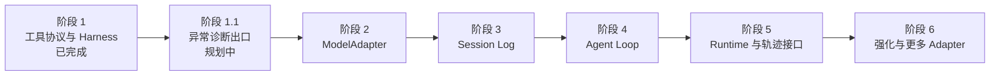

# CommonAgent 分阶段开发路线图

## 1. 路线原则

- 每个阶段先稳定协议、注释、文档和测试，再进入下一阶段。
- CommonAgent 核心不依赖模型 SDK、HTTP 框架、数据库驱动和前端。
- 未实现能力必须标记为“规划中”，不能通过类型占位造成已经可用的错觉。
- 安全边界默认 fail closed；可观测性故障不能改变业务执行结果。
- 当前先在单一项目中验证，不提前拆成 npm 多包工程。

## 2. 阶段总览

## 3. 阶段 1：工具协议与 Harness（已完成）

范围：

- `defineTool()` 将 Schema、实现和执行元数据放在一起。
- Zod 输入/输出校验及 Draft 7 JSON Schema 投影。
- allow/deny/ask 策略与单次审批。
- 幂等重试、随机退避、协作式超时和取消。
- `ToolError`、`ToolExecutionResult` 和工具轨迹事件。
- `get_current_time`、`calculator` 安全内置工具。

当前学习和验证入口见[第一阶段学习指南](./learning-guide.md)。

## 4. 阶段 1.1：服务端异常诊断（规划中）

### 4.1 为什么放在这里

当前 `ToolErrorInfo` 只保留安全公开字段。它适合返回模型、前端轨迹和未来会话事件，但普通
`Error` 的 `stack`、`cause` 与 Node 系统错误字段在归一化后会丢失。

在接入 ModelAdapter 和更复杂 Runtime 前，应先补齐诊断边界，否则网络、策略、审批和事件输出故障会很难定位。

### 4.2 计划范围

- 定义供应商无关、可注入的 `DiagnosticSink` 或最小 `AgentLogger` 协议。
- CommonAgent 不直接依赖 Pino、Winston 或具体日志平台。
- 在原始异常被归一化前记录 `Error`、`stack`、`cause` 和安全的 Node 错误字段。
- 为公开错误生成 `errorId`，用于关联公开轨迹和服务端诊断。
- 覆盖工具执行、策略执行、审批通道和轨迹观察器自身异常。
- Runtime 负责接入具体日志库、日志级别、输出位置、轮转和保留周期。
- 定义脱敏规则，禁止记录 API Key、Authorization、Cookie、完整敏感输入和未经处理的模型上下文。

### 4.3 数据分层目标

| 数据层         | 可以包含                                      | 默认不能包含                      |
| -------------- | --------------------------------------------- | --------------------------------- |
| 模型可见错误   | `code`、安全 `message`                        | `stack`、原始 `cause`、服务器路径 |
| 前端公开轨迹   | 上述字段、`errorId`、安全详情                 | 未脱敏 Header、Secret、完整堆栈   |
| Session Event  | 重建会话所需的安全事实                        | 诊断噪声和敏感运行环境信息        |
| 服务端诊断日志 | `stack`、`cause`、调用关联字段、Node 错误字段 | Secret 和无上限原始载荷           |

### 4.4 验收条件

- 普通 `Error` 和带 `cause` 的 `ToolError` 都能在诊断 Sink 中保留调用链。
- `ECONNRESET`、`ENOENT` 等 Node 错误的安全字段可以被记录。
- 模型结果和公开轨迹中不出现绝对代码路径或完整堆栈。
- 公开错误可通过 `errorId` 定位对应服务端日志。
- Sink 抛出异常时不会改变工具成功或失败结果，也不会递归触发日志风暴。
- 测试覆盖脱敏、关联、Sink 故障隔离和无 Logger 配置的情况。
- 同步更新错误规范、轨迹规范和 Runtime 接入文档。

### 4.5 明确不在本阶段做

- 不选择或绑定具体日志产品。
- 不实现前端日志查看器。
- 不把 `stack` 添加到现有 `ToolErrorInfo` 后直接广播。
- 不把诊断日志混入模型会话历史。

## 5. 阶段 2：ModelAdapter（规划中）

目标是让 Agent Loop 只依赖内部模型协议。

计划范围：

- 定义供应商无关消息、工具调用、用量和结束原因。
- 同时定义非流式响应与标准流事件。
- 定义 `ModelAdapter` 接口、取消语义和错误分类。
- 第一份实现采用 DeepSeek；兼容 OpenAI 协议的 SDK 只能存在于 adapter 内部。
- adapter 将 `DefinedTool.model` 转换成供应商格式。
- 使用契约测试保证 adapter 不泄漏供应商类型到核心。

## 6. 阶段 3：Session Log（规划中）

计划范围：

- 定义 append-only `SessionEvent`。
- 先实现内存 `SessionStore`，不接具体数据库。
- 从事件推导模型消息，而不是维护第二份可变消息数组。
- 区分持久事实、实时事件和诊断 Trace。
- 定义并发追加、版本检查、分页和恢复语义。

## 7. 阶段 4：Agent Loop（规划中）

计划范围：

- 建立 Run、Turn、Step、Tool Call 和 Attempt 状态模型。
- 串联 ModelAdapter、Tool Harness 与 Session Store。
- 支持最大 Step、最大工具调用、token/时间预算和取消。
- 定义停止原因，防止无限循环。
- 明确并行工具调用、失败回写和重放语义。

## 8. 阶段 5：Runtime 与轨迹接口（规划中）

计划范围：

- 将现有 Fastify 代码收敛为外围 Runtime。
- 提供 HTTP/SSE 会话入口和取消入口。
- 暴露可分页查询的轨迹接口，服务前端调试。
- 对公开轨迹实施脱敏、大小限制和访问控制。
- Runtime 组装 ModelAdapter、工具、策略、审批、Store 和诊断 Sink。

## 9. 阶段 6：强化与扩展（规划中）

候选范围：

- 更多模型 Adapter 及供应商能力协商。
- 文件、网络、数据库工具的权限和沙箱设计。
- Worker/子进程隔离与真正可终止的高风险工具。
- Session 压缩、摘要、恢复与确定性重放。
- 指标、OpenTelemetry 接入和评测框架。
- 在协议稳定后评估是否拆分 npm packages。

候选项必须在前序边界稳定后再排期，不能因为“常用”而绕过权限和审计设计。
