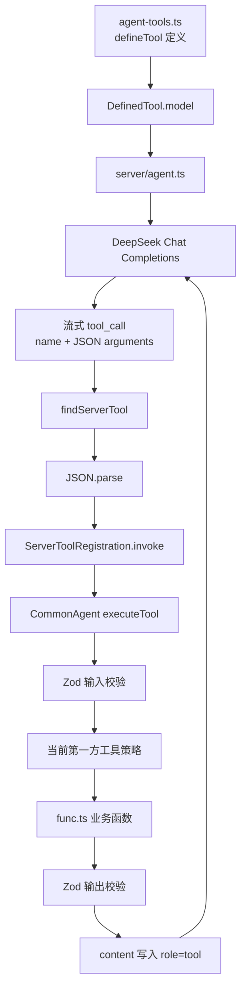

# 现有 Server 接入与自定义工具

## 1. 当前目标

这一阶段不继续抽象完整 Agent，而是先让现有 Fastify + DeepSeek 服务真正使用已经完成的
CommonAgent Tool Harness。开发者可以在真实对话中验证 Schema、工具调用、输出和重试，再继续开发
ModelAdapter、Session 和 Agent Loop。

## 2. 当前文件分工

| 文件                        | 作用                                                         |
| --------------------------- | ------------------------------------------------------------ |
| `src/server/agent.ts`       | 调用 DeepSeek、收集流式工具调用、调用注册工具并写回模型      |
| `src/server/agent-tools.ts` | 使用 `defineTool()` 定义工具，并组成当前服务的静态工具注册表 |
| `src/server/func.ts`        | 时间、定位和天气的业务实现及外部 API 处理                    |
| `src/common-agent/tools/*`  | 供应商无关的定义、校验、权限、重试、执行结果和轨迹协议       |

旧的 `tools.json` 和 `tool-result.ts` 已不再需要。Schema 不再与函数实现分开维护，服务端也不再运行第二套
工具 Harness。

## 3. 接入后的数据流



这里的 `ServerToolRegistration` 只解决一个 TypeScript 问题：不同工具具有不同的 Zod 输入输出泛型，
但服务端注册表需要把它们放在同一个数组中。`invoke()` 在闭包内部保留具体 Schema 类型，再统一返回
`ToolExecutionResult<unknown>`；运行时校验没有被跳过。

## 4. 当前注册的工具

- `get_time`：相对日期、命名时间范围和当前时间。
- `get_user_location`：通过服务器出口 IP 获取近似位置。
- `get_weather`：查询指定城市或近似所在地的当前天气。

模型工具参数由每个定义的 `inputSchema` 自动转换，不再读取手写 JSON 文件。定位和天气工具的临时网络错误
由 CommonAgent 的幂等重试管线处理。

## 5. 开发一个自定义工具

### 5.1 编写业务实现

业务逻辑可以直接写在 `execute()` 中，也可以从独立文件导入。需要网络、数据库等依赖时优先使用闭包注入。

```ts
import { z } from 'zod'
import { defineTool } from '../common-agent'

export const echoTool = defineTool({
  name: 'echo',
  description: '原样返回用户要求回显的文本。',
  inputSchema: z.strictObject({
    text: z.string().min(1).describe('需要回显的文本。'),
  }),
  outputSchema: z.strictObject({
    text: z.string(),
  }),
  security: {
    risk: 'safe',
    capabilities: [],
    idempotent: true,
  },
  execute(input) {
    return { text: input.text }
  },
})
```

### 5.2 加入服务端注册表

在 `src/server/agent-tools.ts` 中加入：

```ts
export const serverTools = Object.freeze([
  createServerToolRegistration(getTimeTool),
  createServerToolRegistration(getUserLocationTool),
  createServerToolRegistration(getWeatherTool),
  createServerToolRegistration(echoTool),
] as const)
```

不需要再修改：

- 独立 JSON Schema 文件。
- 工具名到函数的第二份映射。
- `agent.ts` 中的 switch/case。

`agent.ts` 会自动把 `echoTool.model` 发给 DeepSeek，并在收到同名 Tool Call 时调用 CommonAgent Harness。

### 5.3 编写测试

自定义工具至少验证：

1. 正常输入可以得到 `ok: true`。
2. 非法输入在 `attempts: 0` 时被拒绝，业务函数未执行。
3. 错误输出得到 `INVALID_TOOL_OUTPUT`。
4. 需要网络或数据库时，使用 mock，不在核心测试中访问真实服务。
5. 配置重试时，测试可重试错误和不可重试错误。

可以参考 `test/server-tools.test.ts` 中的 `invokeServerTool()`。

## 6. 本地验证流程

配置环境变量后启动服务：

```powershell
$env:DEEPSEEK_API_KEY = '你的开发密钥'
pnpm dev
```

建议依次测试：

1. “现在几点？”：验证 `get_time`。
2. “杭州天气怎么样？”：验证带城市的 `get_weather`。
3. “我这里天气怎么样？”：验证 IP 定位和天气组合。
4. 添加 `echo` 后要求模型回显指定文本：验证自定义工具注册。
5. 给工具故意返回错误字段：观察 `INVALID_TOOL_OUTPUT` 是否写回模型。

不要把真实 API Key 写入代码、测试或文档。

## 7. 当前仍然保留的过渡代码

- `server/agent.ts` 仍直接依赖 OpenAI SDK 和 DeepSeek 协议，这是下一阶段 ModelAdapter 要解决的问题。
- 会话仍是进程内可变数组，还不是 append-only Session Log。
- 工具事件可以通过 `AgentOptions.onToolEvent` 注入观察器，但还没有轨迹查询 API。
- `trustedServerToolPolicy` 只用于当前静态注册的第一方开发工具，不实现第三方插件信任体系。

这些限制不阻塞当前目标：先运行、测试并开发自定义工具。
