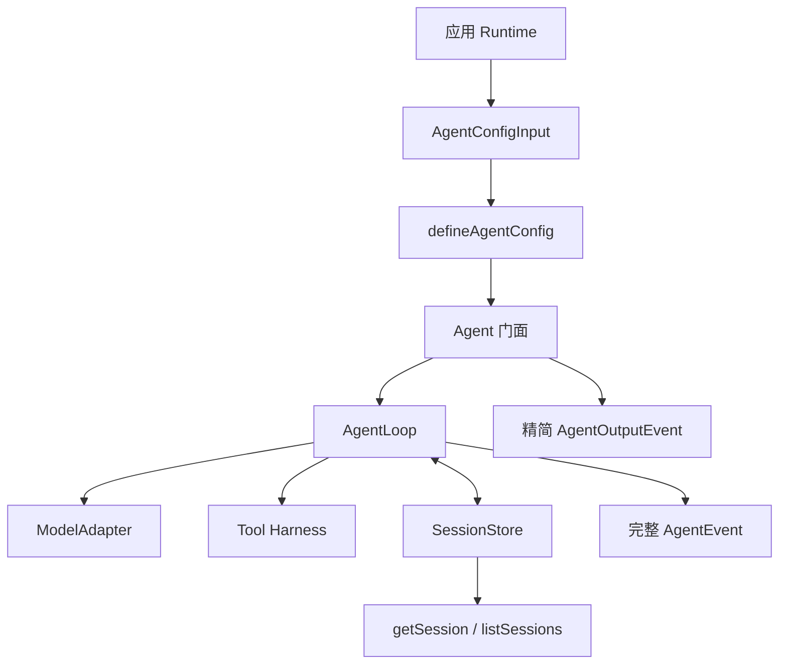

# craft-harness 总体架构

> 文档类型：规范；状态：Accepted。

## 1. 目标

craft-harness 是只面向 Node.js 的通用 agent harness。它负责配置归一化、循环控制、工具调度、模型协议抽象、
会话事实记录和标准事件，不依赖具体 HTTP 框架、数据库驱动或前端。

```text
Fastify / CLI / Worker
          |
       Agent 门面
          |
       AgentLoop
      /    |     \
 Model   Tool    SessionStore
 Adapter Harness
```

应用开发者默认使用 `Agent`。需要测试状态机或实现特殊 Runtime 时，可以直接使用 `AgentLoop` 和各项协议。

## 2. 仓库布局

仓库根就是发布的 npm 包 `craft-harness`（ESM-only，`exports` 暴露 `.` 与 `./adapters`，`files` 只包含
`dist`），官方案例应用整体位于 `sample/`。两者是“库”和“库的使用者”的关系，不是同一个发布单元。

```text
package.json                    # 发布清单：name=craft-harness、exports、files、peerDependencies
tsup.config.ts                  # 库构建：src/index.ts 与 src/adapters/index.ts -> dist/
tsconfig.json                   # 只覆盖 src/**（node only，无 DOM）
vitest.config.ts                # harness（node）与 sample（jsdom）两个 vitest project

src/                            # 库源码：发布出去的全部内容
  index.ts                      # 默认导出 Agent，并重导出公共协议
  agent/
    agent.ts                    # 统一门面、输出投影、Session 查询
    tool-guard.ts               # 风险评估公共协议及底层策略适配
    tool-approval-manager.ts    # Agent 内部一次性审批生命周期
    config.ts                   # defineAgentConfig、Adapter 注入与默认模型选择
    model-options.ts            # 请求级模型整体覆盖与循环前执行设置构造
    event-stream.ts             # 应用事件流的背压与消费者取消
    normalize-tools.ts          # 工具定义的内部归一化边界
    types.ts                    # 门面输入、输出与会话投影
  adapters/                     # 官方 Adapter；独立子入口 ./adapters
    openai-compatible/          # OpenAI SDK 隔离边界
    deepseek/                   # DeepSeek 差异层
  contracts/                    # 模型、消息、错误和 Session Port
  core/                         # AgentLoop 状态机、预算与工具注册
  sessions/                     # Store 实现与消息推导
  tools/                        # defineTool、Harness、策略、重试和错误
    builtins/                   # 内置工具实现、工作区工具与自动注册表
  types/                        # JSON 基础类型

sample/                         # 官方案例应用：库的使用者，不参与发布
  src/server/                   # Fastify Runtime：环境变量、Agent 组装、SSE 与展示投影
  src/pages/index.vue           # 前端页面
  database/migrations/          # PostgreSQL Session Log 迁移
  vite.config.ts                # 案例的 Vite 配置，同时作为 vitest 的 sample project
  test/                         # 案例测试：Runtime、工具、页面与 PostgreSQL 契约

test/                           # 库测试
  support/                      # Scripted Adapter 与协议契约探针
  learning/                     # 可逐行运行的学习型验证脚本
```

### 2.1 发布边界

- 根目录的包清单、`tsup.config.ts` 和根 `tsconfig.json` 只服务 `src/**`；`dist/` 是唯一发布产物。
- `openai`、`zod` 与 `@vscode/ripgrep` 是运行期依赖，执行 `pnpm add craft-harness` 会一起安装；`z` 从根入口
  导出供 `defineTool()` 使用。三者在构建时保持 external，由 Node 从包依赖树解析，不复制进 bundle。
- `scripts/smoke-pack.mjs`（`pnpm smoke:pack`）用 `npm pack` 产出真实 tarball，装进临时项目后按包名导入，
  验证 `exports` 映射、`files` 白名单和 `.d.ts` 是否完整；案例应用走相对路径导入，测不到这一段，所以必须
  单独冒烟。

### 2.2 案例应用不是库的一部分

`sample/` 通过相对路径导入库源码（`sample/src/**` 下写作 `../../../src`），因此它是普通使用者，只是恰好与库
同仓库。HTTP 路由、SSE 传输、环境变量、数据库连接池、Vue 页面和展示投影都只存在于 `sample/`，不进入库的
公共协议，也不随 npm 包分发。

### 2.3 “库不得反向依赖 sample”是硬边界

依赖方向只能从 `sample/` 指向 `src/`，反向引用一律禁止：库一旦导入 `sample/`，发布出去的包就会要求使用者
安装 Fastify、`pg` 和 Vue 才能加载。`test/model-boundary.test.ts` 会遍历 `src/**` 并断言其中不出现指向
`sample/` 的导入，使这条边界由测试守住，而不是靠约定。

## 3. 三层依赖边界

### 3.1 Core

`contracts`、`core`、`sessions`、`tools`（含 `tools/builtins`）和 `types` 构成底层 Core。它们可以依赖 Node.js
标准库、Zod 和自身协议，但禁止依赖：

- OpenAI 或其他模型 SDK。
- Fastify、Express 或其他网络框架。
- Vue 或任何 UI 类型。
- Redis、ORM 或具体数据库驱动。
- 环境变量和应用配置文件。

### 3.2 官方 Adapter 与 Agent 门面

官方 Adapter 指向 Core contracts，并负责隔离 SDK。Adapter 不能通过 craft-harness 根入口导入类型，否则根入口
默认导出 Agent 后会形成循环依赖。

`agent` 是产品便利层，只接受开发者显式注入的 ModelAdapter，并将它与可按请求切换的模型选择组装起来。
它不创建官方 Adapter，不直接接触供应商 SDK 对象，也不把 Adapter 依赖反向传播到 Core。

### 3.3 Runtime

Fastify、CLI 或 Worker Runtime 负责：

- 读取环境变量、Secret 和部署配置。
- 构造一个长期复用的 Agent。
- 将请求、取消信号和 Agent 输出映射到传输协议。
- 将通用 Session 映射为应用展示字段。
- 将来接入日志、轨迹存储和数据库 Store。

Runtime 不是 craft-harness 类名；它是使用 Agent 的宿主环境。本仓库内的参考 Runtime 就是 `sample/src/server`，
它演示如何把一个 Runtime 组装在应用侧，不属于库的发布内容。

### 3.4 公共入口

- `craft-harness` 根入口显式导出普通 Agent 使用、协议实现和高级 AgentLoop 所需的稳定 API。
- `craft-harness/adapters` 是生产模型 Adapter 的高级入口，不合并进普通根入口。
- 工具归一化、审批管理器和测试夹具属于内部实现，不从公共入口导出。
- 当前不提供 `adapters/testing` 或 `sessions/testing`；仓库测试支持代码统一位于 `test/support`。

## 4. 配置与执行数据流



模型历史只从 Session Event 推导。Agent、Runtime 和前端都不能维护另一份权威消息数组。

## 5. 事件与诊断分层

- `SessionEvent`：append-only 持久事实，负责恢复模型历史。
- `AgentEvent`：完整实时执行轨迹，包含 Run、Step、模型 chunk 和工具过程。
- `AgentOutputEvent`：Agent 门面提供的标准应用输出，适合被 CLI、SSE 或 WebSocket 直接消费。
- Diagnostic：未来记录原始 stack、cause、Node 错误字段和 errorId，不进入模型或公开错误。

观察器都是旁路，异常不能改写业务结果。当前已能通过 `onTrace` 暴露完整轨迹，但尚未提供持久化分页查询。

## 6. 当前阶段

1. Tool Harness：已完成。
2. ModelAdapter 与官方 Adapter：已完成。
3. Session Log：已完成。
4. Agent Loop：已完成。
5. craft-harness 统一门面与案例 Runtime 迁移：已完成。
6. 拆分为可发布 npm 包（库上提为 `src/`、案例下移为 `sample/`、改名 `craft-harness`）：已完成。
7. Workspace 生命周期、Session 绑定与运行时工具装载：下一阶段。
8. 轨迹持久化与查询：后续阶段。
9. 异常诊断：后续阶段。
10. 第三方安全、幂等审查和沙箱：长期低优先级。

完整验收项见[分阶段开发路线图](../product/roadmap.md)。
