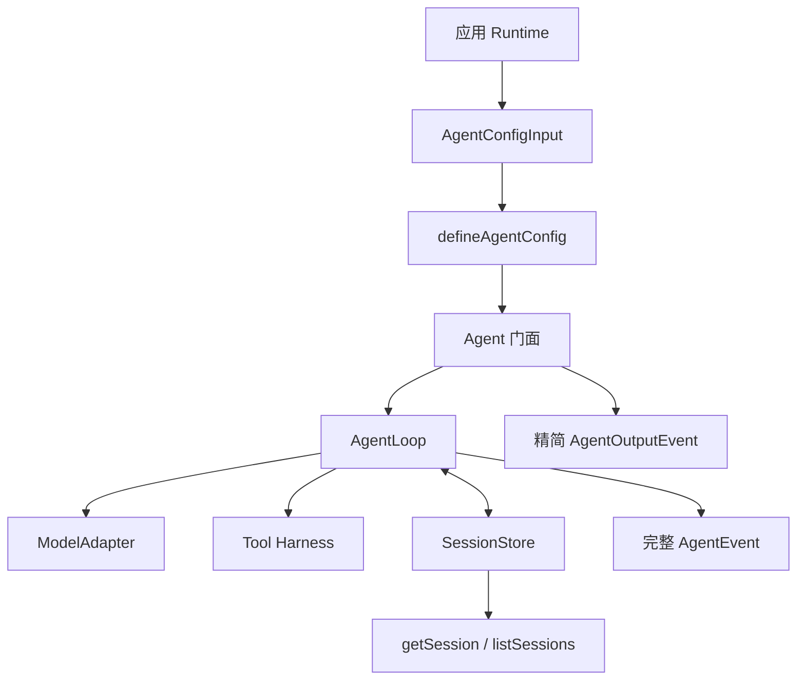

# CraftAgent 总体架构

> 文档类型：规范；状态：Accepted。

## 1. 目标

CraftAgent 是只面向 Node.js 的通用 Agent 产品。它负责配置归一化、循环控制、工具调度、模型协议抽象、
会话事实记录和标准事件，不依赖具体 HTTP 框架、数据库驱动或前端。

```text
Fastify / CLI / Worker
          |
       Agent 门面
          |
       AgentLoop
      /    |     \
 Model   Tool    SessionStore
 Adapter Harness
```

应用开发者默认使用 `Agent`。需要测试状态机或实现特殊 Runtime 时，可以直接使用 `AgentLoop` 和各项协议。

## 2. 当前目录

```text
src/
  craft-agent/
    index.ts                    # 默认导出 Agent，并重导出公共协议
    agent/
      agent.ts                  # 统一门面、输出投影、Session 查询
      tool-guard.ts             # 风险评估公共协议及底层策略适配
      tool-approval-manager.ts  # Agent 内部一次性审批生命周期
      config.ts                 # defineAgentConfig 与内置模型配置
      normalize-tools.ts        # 工具定义的内部归一化边界
      types.ts                  # 门面输入、输出与会话投影
    adapters/
      openai-compatible/        # OpenAI SDK 隔离边界
      deepseek/                 # DeepSeek 差异层
      testing/                  # 无网络 Scripted Adapter 和契约探针
    contracts/                  # 模型、消息、错误和 Session Port
    core/                       # AgentLoop 状态机、预算与工具注册
    sessions/                   # Store 实现、消息推导与独立契约探针入口
    tools/                      # defineTool、Harness、策略、重试和错误
    builtins/                   # 默认工具实现、名称与自动注册表
    types/                      # JSON 基础类型

  server/
    index.ts                    # 环境变量、Agent 构造和进程启动
    agent-tools.ts              # 当前应用的第一方工具
    app.ts                      # Fastify 路由、SSE 和前端展示投影
```

当前仍是单项目结构，不提前拆分 npm packages。

## 3. 三层依赖边界

### 3.1 Core

`contracts`、`core`、`sessions`、`tools`、`builtins` 和 `types` 构成底层 Core。它们可以依赖 Node.js
标准库、Zod 和自身协议，但禁止依赖：

- OpenAI 或其他模型 SDK。
- Fastify、Express 或其他网络框架。
- Vue 或任何 UI 类型。
- Redis、ORM 或具体数据库驱动。
- 环境变量和应用配置文件。

### 3.2 官方 Adapter 与 Agent 门面

官方 Adapter 指向 Core contracts，并负责隔离 SDK。Adapter 不能通过 CraftAgent 根入口导入类型，否则根入口
默认导出 Agent 后会形成循环依赖。

`agent` 是产品便利层，可以根据声明式配置创建官方 Adapter，也可以接受开发者直接注入的 ModelAdapter。
它不直接接触供应商 SDK 对象，且不把 Adapter 依赖反向传播到 Core。

### 3.3 Runtime

Fastify、CLI 或 Worker Runtime 负责：

- 读取环境变量、Secret 和部署配置。
- 构造一个长期复用的 Agent。
- 将请求、取消信号和 Agent 输出映射到传输协议。
- 将通用 Session 映射为应用展示字段。
- 将来接入日志、轨迹存储和数据库 Store。

Runtime 不是 CraftAgent 类名；它是使用 Agent 的宿主环境。

## 4. 配置与执行数据流



模型历史只从 Session Event 推导。Agent、Runtime 和前端都不能维护另一份权威消息数组。

## 5. 事件与诊断分层

- `SessionEvent`：append-only 持久事实，负责恢复模型历史。
- `AgentEvent`：完整实时执行轨迹，包含 Run、Step、模型 chunk 和工具过程。
- `AgentOutputEvent`：Agent 门面提供的标准应用输出，适合被 CLI、SSE 或 WebSocket 直接消费。
- Diagnostic：未来记录原始 stack、cause、Node 错误字段和 errorId，不进入模型或公开错误。

观察器都是旁路，异常不能改写业务结果。当前已能通过 `onTrace` 暴露完整轨迹，但尚未提供持久化分页查询。

## 6. 当前阶段

1. Tool Harness：已完成。
2. ModelAdapter 与官方 Adapter：已完成。
3. Session Log：已完成。
4. Agent Loop：已完成。
5. CraftAgent 统一门面与 Server 迁移：已完成。
6. 轨迹持久化与查询：下一阶段。
7. 异常诊断：后续阶段。
8. 第三方安全、幂等审查和沙箱：长期低优先级。

完整验收项见[分阶段开发路线图](../product/roadmap.md)。
