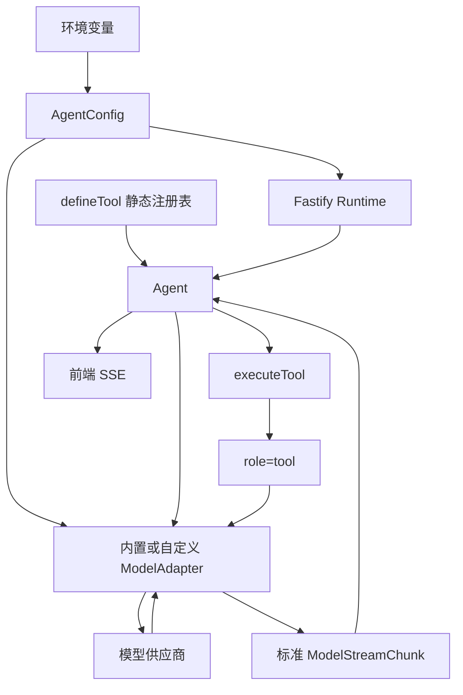

# Server Runtime 接入规范

> 文档类型：集成规范；状态：Accepted。

## 1. 适用范围

本文定义当前 Fastify Runtime 如何组装 Agent、ModelAdapter 和 Tool Harness。它只规定模块边界和不变量；
自定义工具的逐步实践见[自定义工具开发](../../learning/custom-tool-development.md)，阶段实现历史见
[Server 接入交付记录](../../product/deliveries/delivery-002-server-integration.md)。

## 2. 文件职责

| 文件                                            | 职责                                                 |
| ----------------------------------------------- | ---------------------------------------------------- |
| `src/server/index.ts`                           | HTTP、SSE、断开取消和 Runtime 组装                   |
| `src/server/agent-config.ts`                    | Agent 基础配置与模型供应商配置的唯一根               |
| `src/server/agent.ts`                           | 消费标准模型流、拼装工具调用并驱动当前过渡循环       |
| `src/server/agent-tools.ts`                     | 定义第一方应用工具并组成显式静态注册表               |
| `src/common-agent/adapters/openai-compatible/*` | Chat Completions 通用请求、响应、流和错误转换        |
| `src/common-agent/adapters/deepseek/*`          | DeepSeek 消息、thinking、token 参数和 reasoning 差异 |
| `src/common-agent/adapters/testing/*`           | 无网络 Scripted Adapter 与契约探针，不进入生产入口   |
| `src/common-agent/*`                            | 供应商和 Web 框架无关的模型、工具及 JSON 协议        |

CommonAgent Core 不得导入 Fastify、OpenAI SDK、DeepSeek 类型、Vue 或具体持久化驱动。

## 3. 组装与数据流

Runtime 必须在启动边界创建一个 `AgentConfig`。环境变量只允许在 `AgentConfig.fromEnv()` 中读取；
Agent 和 Adapter 不得维护第二份默认模型配置。当前 `fromEnv()` 默认组装 DeepSeek；构造函数同时接受
OpenAI Compatible 和自定义 Adapter 分支。

## 4. 工具注册边界

- 应用工具必须使用 `defineTool()` 定义 Schema、实现和安全元数据。
- 模型参数只能来自 `DefinedTool.model`，不得维护独立 `tools.json`。
- 异构工具通过 `ServerToolRegistration.invoke()` 保留各自 Zod 泛型，再统一暴露执行结果。
- Runtime 使用显式静态注册表，不扫描和加载任意第三方模块。
- 当前 `trustedServerToolPolicy` 只适用于经过代码审查的第一方工具，不能作为插件安全边界。

## 5. 模型与流边界

- `server/agent.ts` 只能依赖 `ModelAdapter` 和 CommonAgent 模型类型。
- OpenAI SDK 只能存在于官方 Adapter 边界；`reasoning_content` 等供应商差异只能存在于对应差异层。
- Agent 传给 Adapter 的消息必须是调用开始时的数组快照。
- 浏览器连接关闭时，Runtime 必须通过同一个 `AbortSignal` 取消模型与工具调用。
- 前端 SSE 是 Runtime 展示协议，不得进入 CommonAgent Core。

## 6. 当前过渡限制

- 会话仍保存在进程内可变数组，服务重启后丢失。
- 同一会话尚未定义并发追加和版本冲突语义。
- 工具调用当前顺序执行。
- 模型 Step 上限存在，但完整预算、停止原因和模型重试留给 Agent Loop。
- 工具事件尚未进入可分页轨迹接口。

这些限制分别由后续 Session Log、Agent Loop 和 Runtime 轨迹阶段处理，不能在当前 Server 中继续增加
平行的临时协议。
