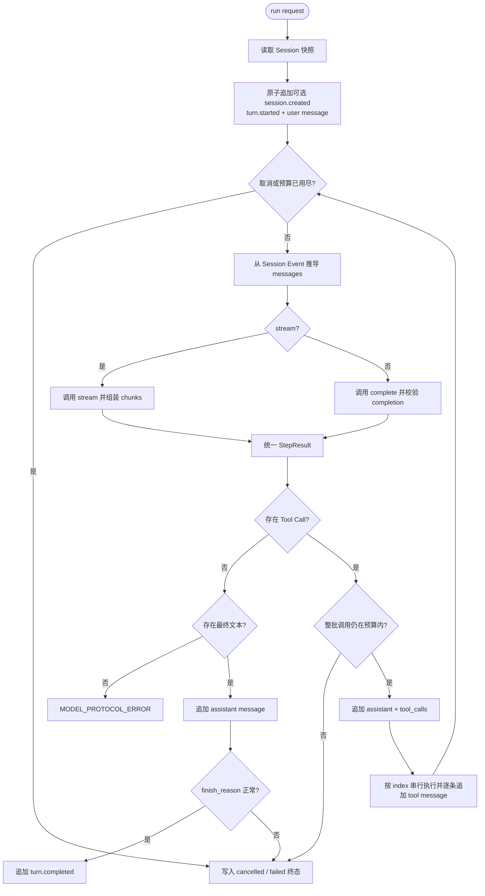

# Agent Loop 协议

> 文档类型：规范；状态：Accepted。

## 1. 职责与依赖边界

`AgentLoop` 负责一次用户 Turn 的完整控制流程：读取 Session、调用模型、组装结果、执行工具、写回消息，
并在完成、预算停止、取消或异常时生成确定终态。

```text
Runtime / CLI / Test
         |
      AgentLoop
      /   |   \
ModelAdapter | SessionStore
        Tool Harness
```

它不得依赖具体模型 SDK、HTTP/SSE、数据库驱动或前端展示类型。默认 `Agent` 门面只是它的上层消费者，
不改变本协议的状态机语义。

## 2. 状态层级

| 层级      | 含义                                            | 当前实现                           |
| --------- | ----------------------------------------------- | ---------------------------------- |
| Run       | 一次 `AgentLoop.run()`，拥有预算、取消和关联 ID | 一次 Run 对应一次用户 Turn         |
| Turn      | 一条用户输入到一个终态                          | completed / failed / cancelled     |
| Step      | 一次模型调用及其返回的一批 Tool Call            | 从 1 开始，受 `maxModelSteps` 限制 |
| Tool Call | 模型要求执行的一次逻辑工具调用                  | 同一批按 index 串行执行            |
| Attempt   | Tool Harness 对某 Tool Call 的一次实际尝试      | 由工具重试策略管理                 |

Run、Turn、Step 属于 Agent Loop；Tool Call 和 Attempt 的执行细节属于 Tool Harness。工具重试不会消耗新的
Model Step，也不会改变模型给出的 `callId`。

## 3. 公共入口

```ts
const loop = new AgentLoop({
  adapter,
  model: { id: 'default-model', reasoningEffort: 'high' },
  store,
  tools,
  systemPrompt,
  limits,
  globalGuard,
  requestToolApproval,
})

const result = await loop.run({
  scopeId,
  sessionId,
  input,
  sessionMetadata,
  context,
}, {
  signal,
  runId,
  turnId,
  model: {
    id: 'other-model',
    stream: false,
    reasoningEffort: 'high',
  },
  onEvent,
})
```

- `adapter` 和 `store` 是必需 Ports；`model` 是必需的默认模型选择。
- Run 级 `model` 一旦提供就整体替换默认模型选择，避免跨模型继承推理等级。
- 不同 Zod 泛型的 `DefinedTool` 先通过 `createAgentTool()` 转成统一注册项。
- `systemPrompt` 和 `sessionMetadata` 只在创建新 Session 时写入。
- 输入会去除首尾空白；空输入在任何 Session 写入前抛出 `TypeError`。
- 构造期拒绝重复工具名和无效预算。

## 4. 主状态机



每次模型请求都会重新读取一个完整固定快照，并验证快照版本等于 Run 当前版本。模型历史必须由
`deriveModelMessages()` 得到，不能由 Loop 维护跨 Run 的第二份消息数组。

## 5. Session 写入顺序

新 Session 的一次带工具 Turn 形成以下事实：

```text
session.created
message.appended   system（可选）
turn.started
message.appended   user
message.appended   assistant + tool_calls
message.appended   tool result 1
message.appended   tool result 2
message.appended   assistant final
turn.completed
```

所有追加都使用 Loop 当前观察到的 `expectedVersion`。发现其他 Writer 改变 Session 时，Run 以
`session_error` 失败，不会自动合并或重新调用模型，因为旧输出依赖旧上下文，工具也可能已经产生副作用。

## 6. 模型结果组装规范

一次 Run 的 `model.stream/reasoningEffort` 在进入循环前解析并固定；`reasoningEffort` 是单轴字符串
（`'off'` 为 Core 保留值），原样进入每次 `ModelRequest`，由 Adapter 翻译成供应商字段。`stream=true` 调用
Adapter 的 `stream()` 并输出 `agent.model.chunk`；`stream=false` 调用 `complete()` 并输出
`agent.model.completed`。两条路径都投影为相同的 StepResult，再进入以下状态机规则。

- 只消费候选 `index=0`；未找到时使用数组第一项。
- `content`、`reasoning_content` 和函数名/参数分片按到达顺序拼接。
- 同一 Turn 包含多个模型 Step 时，每个 assistant 事实分别保存自己的 `reasoning_content`；Run 级
  `AgentRunResult.reasoning` 按 Step 顺序以空行连接。历史展示若提供“本轮思考”，必须按 `turnId` 做同样聚合，
  不能只保留最终 assistant Step。
- Tool Call 按 `index` 排序；同一 Step 的 `id` 必须完整且唯一。
- `custom` Tool Call 和旧版 `function_call` 当前不受支持，返回 `model_protocol_error`。
- `finish_reason=tool_calls` 却没有 Tool Call 属于协议错误。
- 模型上报的 usage 在进入预算计算前必须是非负安全整数。
- 一次 Step 中只累计最后一次非空 usage，避免供应商在多个 chunk 重复上报时重复计数。

Core 固定向模型发送 `parallel_tool_calls: false`。若供应商仍返回多个 Tool Call，Loop 会按 index 串行执行，
以保持 Session 顺序、审批和重放确定性。

## 7. 工具调用规范

模型工具参数先经过 `JSON.parse()`，再交给注册项的 `execute()`。该 `execute()` 是
`createAgentTool()` 创建的 Harness 入口，不是绕过校验直接调用业务工具。

```text
toolCall.arguments
  -> JSON.parse
  -> AgentTool.execute
  -> executeTool
  -> inputSchema / layered guards / approval / retry / outputSchema
  -> ToolExecutionResult.content
  -> role=tool message
```

- 工具不存在或参数 JSON 无效时，Loop 创建标准失败结果并写回模型，Run 可以继续。
- 工具业务失败由 Harness 转成失败 content，默认不会直接终止 Run。
- 策略 `deny` 和审批 `rejected/unavailable` 也属于标准工具失败：实现函数不执行，失败结果以
  `role=tool` 持久化，然后 Loop 继续下一 Model Step。模型因此可以解释拒绝、请求替代方案或给出不依赖该工具的回答。
- 策略 `ask` 会在 Harness 内等待 `ToolApprovalHandler`；只有 `allowed-once` 恢复当前调用的执行。
  审批期间 Run 的时间预算和取消信号仍然有效，断连或处理器异常不能隐式授权。
- 一批 Tool Call 在执行前整体检查 `maxToolCalls`；超限时整批不执行，也不持久化 assistant 调用意图。
- assistant 调用意图写入成功后，每个 Tool Call 都必须得到对应 tool message。
- 批处理中发生取消时，尚未执行的调用写入 `TOOL_ABORTED` 结果，从而不留下缺失 tool message 的模型历史。
- Tool Call 当前串行执行；并行执行需要先定义确定的提交、审批、取消和部分失败语义。

## 8. 预算与停止原因

| 配置项                       | 默认值 | 语义                                             |
| ---------------------------- | ------ | ------------------------------------------------ |
| `maxModelSteps`              | 8      | Run 最多发起的模型流次数                         |
| `maxToolCalls`               | 32     | Run 最多接受和执行的逻辑 Tool Call 数            |
| `maxCompletionTokensPerStep` | 无     | 发送给每次 ModelRequest 的生成 token 上限        |
| `maxTotalTokens`             | 无     | 基于模型已上报 usage，在下一 Step 前检查的总预算 |
| `maxDurationMs`              | 无     | 通过组合 AbortSignal 实现的协作式 Run 时限       |

`AgentRunResult.status` 与 `stopReason` 分离：

- `completed`：模型给出正常最终回答并成功写入 `turn.completed`。
- `stopped`：步数、工具、token、时间预算，调用方取消，或模型 length/content filter 等受控停止。
- `failed`：模型调用、模型协议或 Session 发生异常。

总 token 只能根据供应商上报值观察，不能在请求前精确预测 prompt token；因此上限在 Step 边界执行，最后一个
已完成请求可能已经超过该值。时间限制也是协作式的，Adapter 和工具必须继续传递并观察 `AbortSignal`。

## 9. 实时事件

`AgentEvent` 包含共同的 `runId`、`turnId`、`sessionId` 和 `timestamp`，主要事件顺序为：

```text
agent.run.started
agent.turn.started
agent.step.started
agent.model.chunk                 0..n
agent.tool.call.started           0..n
agent.tool.event                  0..n
agent.tool.call.completed         0..n
agent.step.completed
agent.run.completed | stopped | failed
```

`AgentEvent` 是实时调试协议，不自动进入 Session Log。观察器异常被隔离，不能修改模型、工具、Session 或最终结果。
事件中的工具原始参数和结构化输出可能包含敏感信息；阶段 5 的 Runtime 对外暴露前必须增加脱敏、大小限制和访问控制。

## 10. 当前重放与恢复边界

- 同一个正常 Run 内，每次 Model Step 都从已持久化事实重新推导历史。
- Session 版本冲突不会自动重试模型或工具。
- Adapter 错误不会自动重试。特别是已经输出部分流增量后，自动重试会造成重复 UI 内容和不明确的计费语义。
- 进程在 assistant tool intent 写入后崩溃，可能留下尚无结果的 Tool Call；当前不自动恢复或重放。
- 是否恢复未完成 Turn、如何判断工具已执行、怎样使用幂等键，需要后续单独恢复协议，不能根据日志盲目重执行。

## 11. 错误与诊断边界

公开结果只包含稳定 `code`、`message` 和安全 `details`，不包含原始 `stack` 或 `cause`。完整 Node 异常日志、
`errorId` 关联和 `DiagnosticSink` 仍属于阶段 6；该计划不能阻塞 Agent Loop 主链。
