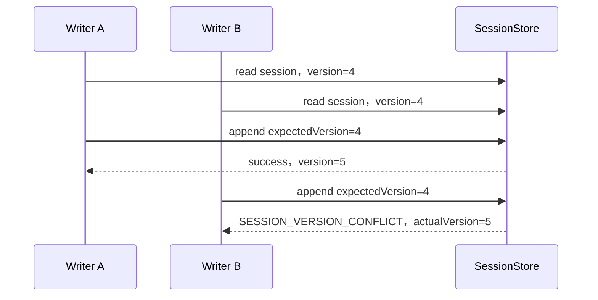
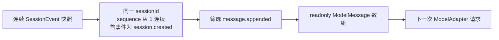

# Session Log 协议

> 文档类型：规范；状态：Accepted。

## 1. 目标

Session Log 是 CraftAgent 的持久事实边界。它使用 append-only 事件记录模型可见消息和 Turn 生命周期，
并从事件确定性推导下一次模型请求所需的 `ModelMessage[]`。

本协议定义供应商无关 Store、内存参考实现、外部持久化约束和消息推导，不把数据库、ORM、HTTP 或前端类型
引入 CraftAgent Core。

## 2. 核心原则

- 已写入事件不能修改或删除。
- 每个 Session 的 `sequence` 从 1 开始严格递增且无空洞。
- Session `version` 等于当前已写入事件数量。
- 追加必须携带 `expectedVersion`，版本不一致时整批拒绝。
- 一批事件必须全成或全败，不能产生部分写入。
- 事件 ID、sequence 和 timestamp 由 Store 分配，调用方不能伪造。
- 持久化事件必须可以安全转换为 JSON。
- 模型历史只能从 Session Event 推导，不能维护第二份权威可变消息数组。

## 3. 事件结构

调用方先创建 `SessionEventDraft`，Store 成功接受后附加 `SessionEventEnvelope`：

```ts
interface SessionEventEnvelope {
  eventId: string
  sessionId: string
  sequence: number
  timestamp: string
}
```

当前事件类型：

| type               | 事实                                     | 是否进入模型历史 |
| ------------------ | ---------------------------------------- | ---------------- |
| `session.created`  | Session 已创建，可携带 JSON metadata     | 否               |
| `message.appended` | 一条 `ModelMessage` 已成为模型可见历史   | 是               |
| `turn.started`     | 某个 Turn 已开始                         | 否               |
| `turn.completed`   | 某个 Turn 已正常完成                     | 否               |
| `turn.failed`      | 某个 Turn 因安全、可持久化的规范错误结束 | 否               |
| `turn.cancelled`   | 某个 Turn 被调用方取消                   | 否               |

`runId` 和 `turnId` 是关联字段，不用于决定事件顺序。SessionStore 只检查最小事件结构；完整 Turn 状态机
由 AgentLoop 负责。

## 4. Session 初始化

一个新 Session 的第一次追加满足：

```text
expectedVersion = 0
events[0].type = session.created
整条 Session 只能出现一次 session.created
```

创建事件和初始系统消息可以在同一批中提交：

```ts
await store.append({
  sessionId: 'session-1',
  expectedVersion: 0,
  events: [
    { type: 'session.created' },
    {
      type: 'message.appended',
      message: { role: 'system', content: '你是一个 AI 助手。' },
    },
  ],
})
```

这样不会出现“Session 已创建，但初始系统事实尚未写入”的中间状态。

## 5. 乐观并发



冲突后由上层重新读取并决定是否重试。Store 不能自动把旧决策追加到新历史之后，因为新的事件可能改变
模型上下文和业务含义。

## 6. 一致性分页

`read()` 支持：

- `afterSequence`：从指定 sequence 之后读取。
- `limit`：默认 100，最大 1000。
- `throughVersion`：把多页读取固定到某个版本。

第一页返回 `snapshotVersion`。后续页面必须继续携带该值；读取期间追加的新事件不会混入当前快照。

```text
第一页：snapshotVersion=250，读取 1..100
此时新事件写入，latestVersion=251
第二页：throughVersion=250，读取 101..200
第三页：throughVersion=250，读取 201..250
```

`readSessionSnapshot()` 已封装这个分页过程，并检测 Store 返回 `hasMore=true` 但游标不前进的协议错误。

## 7. 模型消息推导



`deriveModelMessages()` 不会排序、不修复坏序列，也不会把 Turn 状态和诊断信息发送给模型。发现混合 Session、
sequence 空洞或缺少创建事件时直接失败。

工具调用和工具结果仍使用模型协议中的 assistant `tool_calls` 消息与 `role: 'tool'` 消息，因此它们同样通过
`message.appended` 成为可重建历史。

## 8. JSON 持久化边界

`MemorySessionStore` 在提交前通过 JSON 往返复制事件，拒绝：

- 循环引用。
- `bigint`。
- 函数和 Symbol。
- `NaN`、`Infinity` 和 `-Infinity`。

输入副本和返回事件会被深度冻结，调用方之后修改原对象不能改写日志。

数据库 Store 必须提供等价的序列化约束，不能依赖 ORM 的静默转换。

## 9. Store 接口

```ts
interface SessionStore {
  append: (
    request: AppendSessionEventsRequest,
  ) => Promise<AppendSessionEventsResult>

  read: (
    sessionId: string,
    options?: ReadSessionEventsOptions,
  ) => Promise<SessionEventPage>
}

interface SessionCatalogStore extends SessionStore {
  list: (options?: ListSessionsOptions) => Promise<SessionListPage>
}
```

实现要求：

- `append()` 的版本比较、sequence 分配和整批写入必须处于同一原子边界。
- `eventId` 在 Store 范围内唯一。
- 相同 Session 的事件按 sequence 返回。
- `throughVersion` 不能读取超过指定版本的事件。
- 未找到的 Session 读取为空快照，version 为 0；创建仍必须显式追加 `session.created`。
- `list()` 属于 `SessionCatalogStore` 目录能力，按首次创建顺序使用 `afterSessionId` 和 `limit` 分页。
- 列表只返回 sessionId、createdAt、version 和 metadata；完整消息仍由事件快照推导。
- 实现不得把数据库连接、ORM 类型或供应商异常泄漏到 Core 协议。
- 只支持 Agent 执行的 Store 实现 `SessionStore`；同时支持会话列表的 Store 实现 `SessionCatalogStore`。

内置 `MemorySessionStore` 是无数据库开发、测试和协议验证实现，不是生产持久化层。它的数据随进程退出丢失，
并且默认不执行 TTL 或容量驱逐。长期运行的 Runtime 应注入外部 Store；CraftAgent 不要求每个使用者为了首次
运行而重复实现一份内存 Store，也不把缓存、数据库连接或用户权限加入通用协议。

## 10. 外部持久化适配

SQL、ORM、文件、远程 API 和业务 Service 都通过实现 `SessionStore` 接入：

```ts
const store = new ApiSessionStore({ client })
const agent = new Agent({ model, store })
```

完整数据库表、事务、分页、用户 metadata 扩展和测试实践见
[持久化 SessionStore 教程](../../learning/persistent-session-store.md)。

`read()` 必须直接从该实现的权威外部数据源读取，`append()` 必须直接提交到该数据源。禁止先把外部历史完整
装入 `MemorySessionStore` 再维护第二份日志，也禁止新增覆盖式 `saveSession()` 或 `updateSessionLog()`。

连接池、ORM Client、HTTP Client 和业务 Service 由 Runtime 构造后注入 Store。以下操作不属于
`SessionStore`：

- 建库、建表和数据库迁移。
- 建立或关闭连接池。
- 历史数据批量导入、备份和恢复。
- Session 删除、归档、搜索和展示投影。

这些能力由部署生命周期或独立管理接口负责。历史导入若有需要，应定义独立的 `SessionLogImporter`，不能成为
Agent 正常执行所依赖的方法。

## 11. SQL 事务参考

关系数据库推荐至少维护：

```text
sessions
  session_id      primary key
  version         non-negative integer
  created_at      timestamp
  metadata_json   json

session_events
  session_id
  sequence
  event_id        unique
  timestamp
  type
  payload_json    json
  primary key (session_id, sequence)
```

一次 `append()` 必须在同一事务中完成：

1. 锁定或条件更新 Session 当前版本。
2. 比较当前版本与 `expectedVersion`。
3. 为整批事件分配连续 sequence、唯一 eventId 和 timestamp。
4. 插入全部事件并把 Session version 增加批次长度。
5. 提交后返回数据库实际保存的事件；任一步失败都回滚。

ORM 实现也必须建立同样的数据库约束，不能只依靠进程内检查。多实例部署时禁止使用进程锁代替数据库事务或
compare-and-swap。

远程 API Adapter 若在一次 `append()` 内自动重试，所有下游尝试必须复用同一幂等键，并在第一次提交成功后
返回同一结果。无法确认请求是否已经提交时不得用新幂等键盲目重试；CraftAgent Core 当前不会自动重试 Store
写入。

## 12. 规范错误

| code                             | 含义                                  |
| -------------------------------- | ------------------------------------- |
| `SESSION_INVALID_ARGUMENT`       | ID、版本、分页或事件参数无效          |
| `SESSION_VERSION_CONFLICT`       | expectedVersion 与实际版本不一致      |
| `SESSION_INVALID_EVENT_SEQUENCE` | 初始化、顺序或读取协议不成立          |
| `SESSION_SERIALIZATION_FAILED`   | 事件不能安全持久化为 JSON             |
| `SESSION_EVENT_ID_CONFLICT`      | Store 生成了重复事件 ID               |
| `SESSION_OPERATION_FAILED`       | 数据库、文件、Service 或 API 操作失败 |

外部实现必须把驱动、ORM、网络和 Service 异常包装为 `SessionStoreError`，使用
`SESSION_OPERATION_FAILED` 并填写 `operation: 'append' | 'read' | 'list'`。原始异常只放入 `cause`，不能把
连接字符串、SQL、认证信息或供应商对象写入公开 message。版本冲突必须继续使用专用错误并返回
`expectedVersion` 与 `actualVersion`。

## 13. 契约测试

所有 SessionStore 实现必须运行独立入口提供的无测试框架契约探针：

```ts
import { assertSessionStoreContract } from 'craft-agent/sessions/testing'

await assertSessionStoreContract(store, {
  requireCatalog: true,
})
```

探针覆盖空会话、初始化、批量原子性、版本冲突、JSON 序列化、事件身份与连续顺序、调用方对象隔离、固定快照
分页和可选目录分页。它会真实写入多个 Session，测试必须提供临时 schema、事务夹具、测试容器或独立命名空间；
不得对生产数据源运行。

契约探针验证通用行为，不能代替实现专项测试。SQL 实现仍需测试死锁、唯一约束映射和事务回滚；远程 API 实现
仍需测试超时、认证、幂等重试和响应协议错误。

## 14. 当前明确不实现

- 随 CraftAgent Core 内置具体数据库、ORM、Redis、文件或 API Store。
- Session 删除、归档和搜索。
- Session 压缩、摘要和历史裁剪。
- 轨迹、指标和异常堆栈日志。
- 将 Runtime 或前端展示字段写入 Core Session 协议。

数据库查询不会作为模型可调用的内置工具提供。Session 持久化属于基础设施；确需让模型访问业务数据时，应定义
最小权限的领域工具，而不是通用 SQL 工具。

这些能力不能通过修改已写入事件实现；需要时应增加新事件、Store 适配器、管理端口或上层投影。
当前 Agent Loop 如何消费本协议见[Agent Loop 协议](./agent-loop.md)。
