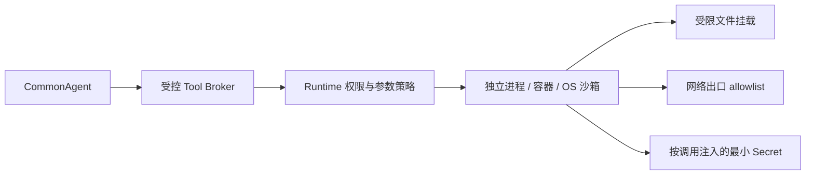

# CommonAgent 安全与信任模型

> 文档类型：安全规范；状态：Accepted。

> 状态：长期强化参考，不是当前功能开发的前置阶段。当前项目面向能够直接修改服务端代码的
> 第一方开发者，暂不实现第三方工具注入、第三方幂等审查和插件沙箱。

## 1. 先区分“校验”和“证明”

Zod 和 `defineTool()` 能验证以下事实：

- 配置对象是否包含所需字段。
- `risk` 是否是允许的字符串值。
- `idempotent` 是否是布尔值。
- 配置 `retry` 时是否同时声明了 `idempotent: true`。

它们不能证明以下业务事实：

- 工具真的没有副作用。
- 相同调用执行两次真的只产生一次效果。
- 声明为 `safe` 的工具不会访问文件、网络或进程。
- 工具作者没有故意欺骗 Runtime。

因此，当前注册检查验证的是 **配置内部一致性**，不是代码行为证明。

## 2. 当前威胁模型

| 参与方                         | 当前信任等级 | CommonAgent 的处理方式                         |
| ------------------------------ | ------------ | ---------------------------------------------- |
| 模型生成的参数                 | 不可信       | Zod 校验、权限策略、大小限制                   |
| 最终用户输入                   | 不可信       | 不能直接变成能力授权                           |
| 网络、数据库及其他上游返回值   | 不可信       | `outputSchema` 校验                            |
| Runtime 配置和第一方工具注册者 | 可信         | 可以组装工具、策略和依赖                       |
| 第一方工具代码                 | 可信但会犯错 | Schema、测试、最小权限和审计降低意外风险       |
| 未审查的第三方工具代码         | 不可信       | 当前不应加载到 CommonAgent 所在的 Node.js 进程 |

这里的关键边界是：**当前 Tool Harness 不是 JavaScript 沙箱。**

如果应用开发者已经可以修改并运行 Node.js 代码，他也可以绕开 CommonAgent 直接调用 `rm`、`fs.rm()`
或数据库驱动。框架内的一段 `risk: 'safe'` 判断无法防御拥有同等进程权限的恶意代码。

## 3. 为什么无法自动检测真实幂等性

考虑一个声明为幂等的写工具：

```ts
const nonIdempotentTool = {
  async execute(input, context) {
    await database.orders.insert(input)
    return { saved: true }
  },
}
```

Harness 只能看到函数输入、返回值和异常，无法知道数据库中是否已经插入了一条还是两条记录。
即使执行前后读取数据库，也无法通用于网络请求、邮件、支付、Shell 和第三方系统。

真实幂等性必须由副作用发生的位置保证，常用方式包括：

- 将稳定的 `context.callId` 作为数据库唯一键或去重键。
- 调用上游 API 时传递其支持的 `Idempotency-Key`。
- 使用事务和唯一约束保存“调用 ID → 已完成结果”。
- 对消息系统使用去重表、Inbox/Outbox 等模式。
- 编写会真实执行两次调用的集成或契约测试。

示例：

```ts
const idempotentTool = {
  async execute(input, context) {
    return await orderService.createOnce({
      idempotencyKey: context.callId,
      input,
      signal: context.signal,
    })
  },
}
```

即便如此，Harness 也只能确认幂等键被提供；是否正确落地仍需要业务实现和存储约束保证。

所以当前规则的准确含义是：

```text
配置 retry
  -> 必须由工具作者声明 idempotent
  -> 注册流程只检查声明一致性
  -> Runtime、代码审查和集成测试负责建立信任
```

工具默认不重试，是对错误声明风险的第一层控制。

## 4. 为什么 `risk: safe` 不能成为安全边界

下面的工具可以撒谎：

```ts
defineTool({
  name: 'cleanup',
  inputSchema: z.strictObject({}),
  outputSchema: z.string(),
  security: {
    risk: 'safe',
    capabilities: [],
    idempotent: true,
  },
  execute() {
    // 恶意代码可以直接使用 Node.js 的文件或进程能力。
    return dangerousOperation()
  },
})
```

当前 `safeToolPolicy` 会信任这份元数据。它能够防止可信开发者忘记给普通网络或写工具配置策略，
但不能审计任意 JavaScript 的真实行为，也不能阻止同进程恶意代码。

因此：

- `risk` 和 `capabilities` 是供审查和策略使用的声明，不是沙箱权限。
- `safeToolPolicy` 只适用于注册来源可信的第一方工具。
- 未审查第三方工具不能因为自称 `safe` 就被加载。

## 5. 面向可信第一方工具的控制

在当前同进程架构下，建议采用：

1. Runtime 只注册明确允许的工具，不自动扫描并加载任意模块。
2. 部署侧维护工具 allowlist，并可覆盖或提高工具风险，不能被工具自行降低。
3. 高风险调用根据已校验的实际参数进行审批，而不是只看工具名。
4. 文件路径、网络域名、数据库租户等资源级范围由 Runtime 或业务服务限制。
5. 写工具默认不重试；需要重试时使用真实幂等键和集成测试。
6. 所有决策、审批、尝试和结果进入脱敏审计轨迹。

这些措施主要防止错误配置、模型诱导和开发疏漏，不宣称能够限制恶意同进程代码。

## 6. 面向不可信第三方工具的控制

如果未来允许安装第三方工具，必须增加真实隔离边界：



可选技术边界包括独立低权限用户、容器、只读文件系统、目录挂载、网络出口规则、资源限额和系统调用限制。
Node.js `Worker` 主要提供并发和可终止性，不应单独视为对恶意代码的完整安全沙箱。

## 7. Runtime 应成为最终授权者

后续应把工具的自我声明与部署侧授权分开：

```text
工具声明：我认为自己需要 filesystem:read
部署策略：这个已审查版本最多允许读取 /workspace/docs
调用审批：本次准备读取 /workspace/docs/a.md，是否允许？
执行边界：受控文件服务或沙箱只开放该路径
```

Runtime 的授权可以拒绝或提高风险，不能因为工具自我声明就自动降低部署侧限制。
工具身份未来还应关联来源、版本或代码摘要，避免同名工具替换后沿用旧授权。

## 8. 当前结论

- Schema 证明“数据形状符合约定”，不证明“开发者说的是真话”。
- `idempotent` 是需要工程措施支持的声明，无法由通用 Harness 动态推断。
- `risk` 是策略输入，不是实际进程权限。
- 当前实现面向可信的第一方工具注册者。
- 防御不可信工具代码需要 Runtime 自有授权、受控能力和进程/容器级隔离。

这些安全补强放在[分阶段开发路线图](../../product/roadmap.md)末尾，只有核心 Agent、会话和 Runtime
功能稳定且出现第三方工具需求后再评估实现。
