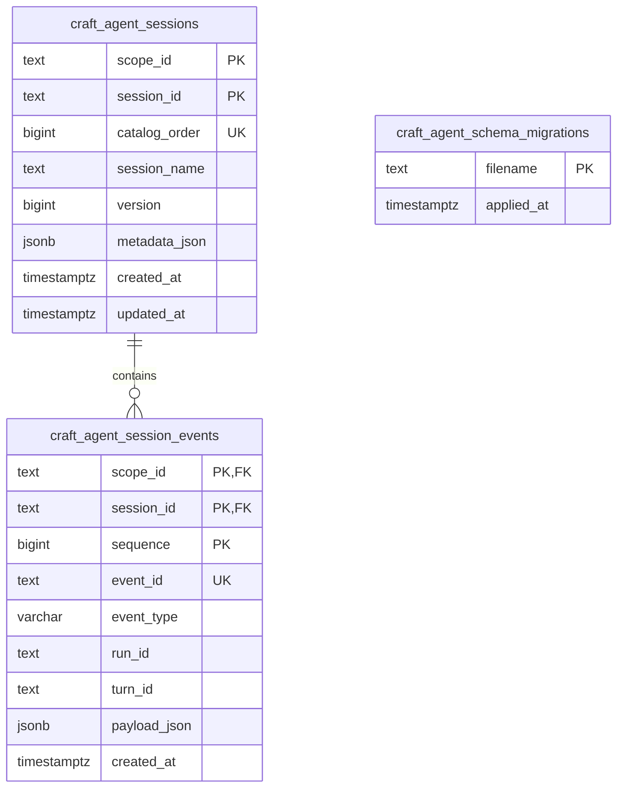

# sample PostgreSQL 数据库

本目录是官方 sample 数据库结构的入口。SQL 文件是结构的唯一事实源；本文说明最终表结构、初始化方式和迁移
规则，方便接入其他 PostgreSQL 实例或把参考实现改写为 ORM。

该数据库属于 `sample/` 后端应用，不属于 `craft-harness` npm 包。库只定义 `SessionStore` 契约，不创建数据库、
管理连接或要求其他使用者采用这些表名。

## 初次运行

开发者需要先创建一个可连接的 PostgreSQL 数据库，并在 `sample/.env.local` 配置
`CRAFT_AGENT_DATABASE_URL`。随后直接运行：

```bash
pnpm dev
```

sample Server 会在监听 HTTP 端口前自动执行全部未应用迁移。空数据库会创建所需扩展、迁移登记表、Session
目录表和事件表；已有数据库只执行新增迁移。多个 Server 同时启动时使用 PostgreSQL advisory lock 串行迁移。

部署流水线也可以提前执行：

```bash
pnpm db:migrate
pnpm db:check
```

`db:migrate` 与 Server 启动复用同一个迁移函数，可以重复执行。自动迁移只负责数据库内的结构，不会创建
PostgreSQL 数据库或用户。连接账号需要在目标 schema 中创建表、索引和约束的权限；首次执行 `002` 还需要能够
安装 `pg_trgm` 扩展，或由数据库管理员预先安装该扩展。

## 当前关系



当前没有 Workspace 表或 `workspace_id`。它们属于
[下一阶段 Workspace 计划](../../docs/product/plans/workspace-lifecycle.md)，不能提前假设已经存在。

## 表结构

### `craft_agent_schema_migrations`

| 字段         | 约束               | 用途                   |
| ------------ | ------------------ | ---------------------- |
| `filename`   | 主键               | 已成功提交的迁移文件名 |
| `applied_at` | 非空，默认当前时间 | 应用时间               |

迁移文件只有在整个文件事务提交前才会登记。启动器据此跳过已执行版本。

### `craft_agent_sessions`

| 字段            | 约束                           | 用途                                  |
| --------------- | ------------------------------ | ------------------------------------- |
| `scope_id`      | 复合主键，非空白               | 应用定义的 Session 数据分区           |
| `session_id`    | 复合主键，非空白               | scope 内的 Session ID                 |
| `catalog_order` | identity、唯一                 | 稳定的目录分页游标                    |
| `session_name`  | 可空；非空时不得为空白         | 可搜索、可重命名的展示名称            |
| `version`       | 非空、默认 0、不得为负         | append 乐观并发版本，也是最新事件序号 |
| `metadata_json` | 可空；非空时必须是 JSON object | 创建 Session 时的持久化扩展快照       |
| `created_at`    | 非空                           | Session 创建时间                      |
| `updated_at`    | 非空                           | 最近一次追加或重命名时间              |

主要索引包括 `(scope_id, catalog_order)` 目录分页索引，以及 `session_name` 的 `pg_trgm` GIN 索引。所有 Session
查询必须同时携带 `scope_id`，`scope_id` 本身不是授权凭证。

### `craft_agent_session_events`

| 字段           | 约束                       | 用途                         |
| -------------- | -------------------------- | ---------------------------- |
| `scope_id`     | 复合主键、复合外键，非空白 | 与 Session 相同的数据分区    |
| `session_id`   | 复合主键、复合外键         | 所属 Session                 |
| `sequence`     | 复合主键，必须大于 0       | Session 内严格递增的事件序号 |
| `event_id`     | 非空白、全表唯一           | 事件生产方身份和重复写入保护 |
| `event_type`   | 非空白，最长 64            | Session Event 判别字段       |
| `run_id`       | 可空                       | 关联 Agent Run               |
| `turn_id`      | 可空                       | 关联对话 Turn                |
| `payload_json` | 非空 JSON object           | 不同事件类型的完整 payload   |
| `created_at`   | 非空                       | 事件发生时间                 |

`(scope_id, session_id)` 外键指向 Session 目录。事件按 `(scope_id, session_id, sequence)` 读取；另有非空
`run_id` 和 `(session_id, turn_id, sequence)` 辅助索引。外键没有 `ON DELETE CASCADE`，sample 的显式删除操作
会在同一事务中先删事件、再删 Session。

## 迁移历史

| 文件                                     | 作用                                                                         |
| ---------------------------------------- | ---------------------------------------------------------------------------- |
| `001-create-session-log.sql`             | 创建最初的 Session 目录、事件表和基础索引                                    |
| `002-add-session-scope-and-name.sql`     | 增加 scope、可搜索名称、`pg_trgm` 和复合外键                                 |
| `003-use-composite-session-identity.sql` | 将 `(scope_id, session_id)` 固化为主身份，允许不同 scope 使用相同 Session ID |

## 新增或修改结构

1. 不修改已经发布或在共享数据库执行过的迁移文件。
2. 在 `sample/database/migrations/` 新增下一个三位编号的 kebab-case SQL 文件，例如 `004-add-workspaces.sql`。
3. 迁移必须能从上一版本前向执行；涉及旧列时显式回填，再增加 `NOT NULL` 或外键。
4. 同步更新本文、PostgreSQL Store 和 Memory/PostgreSQL 共用的契约测试。
5. 执行 `pnpm db:migrate`、`pnpm db:check`、`pnpm db:test-store` 和 `pnpm release:check`。

应用自己的用户、权限、业务搜索或统计字段应放在应用表或投影中，不要持续扩大通用 Session 表。
